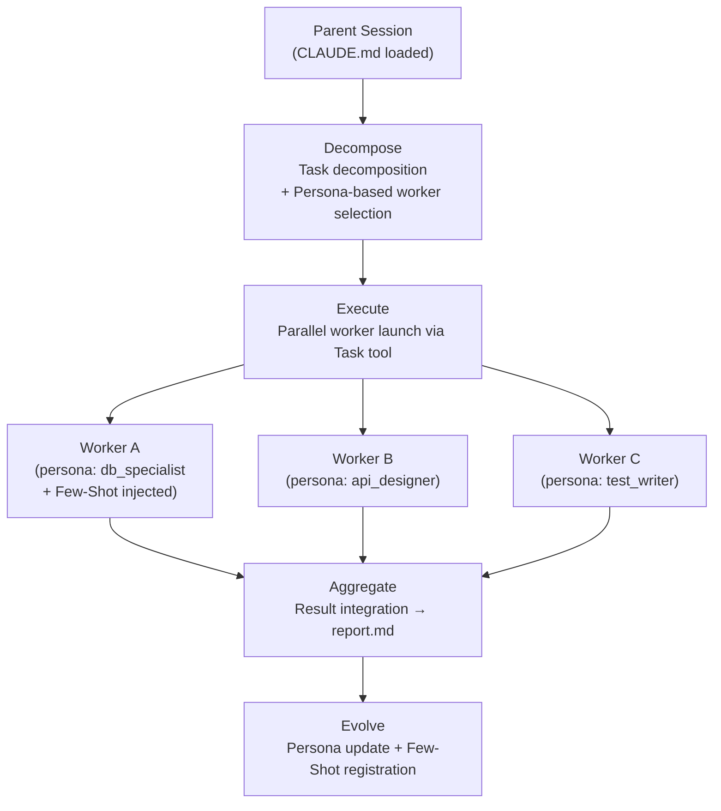
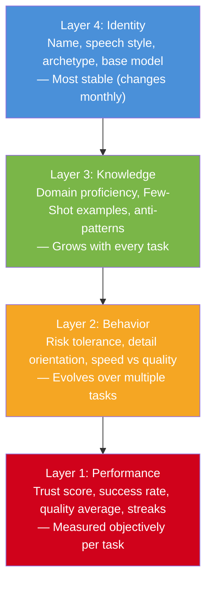

# TANEBI — Evolving AI Agent Framework

> "Use it, and it grows smarter." / 「使えば使うほど賢くなる」

## What is TANEBI?

TANEBI (種火 — "seed fire") is an **evolving multi-agent persona framework**. In conventional multi-agent systems, agents are disposable workers: their memory resets every session, and the 100th task starts with the same capability as the first. TANEBI changes this.

At its core, TANEBI gives each agent a **Persona** — a persistent identity that grows and specializes through task execution. Success patterns are reinforced, failure patterns are recorded, and the entire team becomes compoundingly smarter over time. The Evolution Engine is the heart of the system: it drives individual agent growth and shared knowledge accumulation simultaneously.

## Quick Start

```bash
git clone https://github.com/skaji18/tanebi
cd tanebi
claude  # CLAUDE.md auto-loads — TANEBI starts as your orchestrator
```

Three steps. No tmux, no process managers, no extra infrastructure. Just Claude Code.

## Architecture



**Five-step loop**: Orchestrate → Decompose → Execute → Aggregate → Evolve. Each cycle makes the team stronger.

## Persona — The Agent's Identity

Every agent carries a **4-layer Persona** defined in YAML:



Personas persist across sessions. Copy them, merge them, version them — they are the living memory of your agent team.

## Evolution Engine

TANEBI runs a **dual evolution** architecture:

- **Individual Evolution** — Each agent's Persona evolves through selection, mutation, crossover, and fitness evaluation. Success reinforces traits; failure triggers correction.
- **Knowledge Evolution** — A shared **Few-Shot Bank** accumulates successful task examples. New workers automatically receive relevant examples from past successes. A knowledge GC prevents bloat.

The **fitness score** drives decisions:

```
fitness = 0.35 × quality + 0.30 × completion_rate + 0.20 × efficiency + 0.15 × growth_rate
```

Agents that perform well get more tasks in their domain. Agents that struggle get corrective feedback baked into their Persona. The team self-optimizes.

## Commands

| Command | Description |
|---------|-------------|
| `bash scripts/new_cmd.sh "<task>"` | Create new task workspace |
| `bash scripts/show_evolution.sh` | Show all Persona KPIs |
| `bash scripts/evolve.sh <cmd_id>` | Run evolution after task completion |
| `bash scripts/persona_ops.sh list` | List all Personas |
| `bash scripts/persona_ops.sh copy <src> <new>` | Copy a Persona |

## Project Structure

```
tanebi/
  CLAUDE.md              # Orchestrator instructions (auto-loaded)
  config.yaml            # Framework configuration
  personas/
    active/              # Currently active Personas
    library/             # Templates & snapshots
    history/             # Version history
  knowledge/
    few_shot_bank/       # Success example library
    episodes/            # Episode memory
  work/                  # Task workspaces (cmd_001/, cmd_002/, ...)
  templates/             # Worker / Decomposer / Aggregator templates
  scripts/               # Evolution & Persona operation scripts
  modules/               # Pluggable modules (Trust, Cognitive, etc.)
  docs/                  # Design documents
```

## Documentation

- [Design Document](docs/design.md) — Full architecture, Persona spec, Evolution Engine, MVP roadmap

## License

MIT
