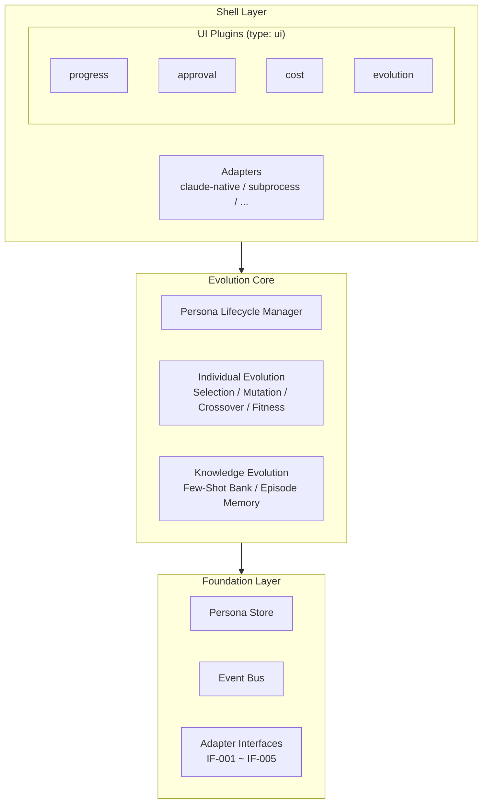

<p align="center">
  <strong>TANEBI</strong><br/>
  <em>Evolving Multi-Agent Persona Framework</em><br/>
  <em>( 進化するマルチエージェント人格フレームワーク )</em>
</p>

<p align="center">
  
  
  
</p>

---

> **The spark that never dies** -- agents that grow with every task.

In conventional multi-agent systems, agents are disposable: their memory resets every session, and the 100th task starts with the same capability as the first. **TANEBI** changes this by giving each agent a persistent **Persona** that evolves through task execution. Success patterns are reinforced, failure patterns are recorded, and the entire team becomes compoundingly smarter over time.

## Quick Start

```bash
git clone https://github.com/skaji18/tanebi
cd tanebi
claude
```

That's it. `CLAUDE.md` auto-loads and TANEBI starts as your orchestrator. No tmux, no process managers, no extra infrastructure -- just Claude Code.

## Architecture

TANEBI separates a stable **Core** (Evolution Engine + Persona management) from a swappable **Shell** (UI plugins + adapters). The core is environment-agnostic; the shell adapts to your runtime.



**Five-step loop per task**: Decompose --> Execute (parallel workers) --> Aggregate --> Evolve. Each cycle makes the team stronger.

## Directory Structure

```
tanebi/
  CLAUDE.md              # Orchestrator (auto-loaded by Claude Code)
  config.yaml            # Framework configuration

  personas/
    active/              # Live Personas (YAML)
    library/seeds/       # Starter templates
    history/             # Auto-snapshots every 5 tasks

  knowledge/
    few_shot_bank/       # Successful examples by domain
    episodes/            # Episode memory

  plugins/               # Unified plugin system
    trust/               # (type: core) Trust-based permission control
    progress/            # (type: ui) Real-time worker status
    approval/            # (type: ui) Plan review gate
    cost/                # (type: ui) Token usage tracking
    evolution/           # (type: ui) Persona growth visualization
    history/             # (type: ui) Past task search
    _template/           # Create your own plugin

  work/                  # Task workspaces (work/cmd_001/, ...)
  templates/             # Decomposer / Worker / Aggregator templates
  scripts/               # Evolution engine & utility scripts
  docs/                  # Design documents
```

## Plugin System

TANEBI uses a **unified plugin system** with two types:

| Type | Role | Capabilities |
|------|------|-------------|
| **core** | Intervene in task flow | Can allow/deny task assignments, hook into lifecycle events |
| **ui** | Observe and display | Subscribe to events, send feedback to Core via Feedback Channel |

Every plugin is a directory with `plugin.yaml` + `handler.sh`. Enable or disable them in `config.yaml`. Creating a custom plugin is as simple as copying `plugins/_template/`.

## Preset Configurations

Pick a preset in `config.yaml`, or customize individually:

| Preset | Plugins Enabled | Best For |
|--------|----------------|----------|
| **minimal** | trust, approval (plan review only) | Getting started, simple tasks |
| **standard** | trust, progress, approval, cost, evolution | Daily use |
| **full** | All plugins including history + wave gates | Power users |

```yaml
# config.yaml
tanebi:
  plugins:
    preset: "standard"   # minimal | standard | full | custom
```

## Persona Evolution

The heart of TANEBI. Every agent carries a **4-layer Persona**:

| Layer | Contains | Changes |
|-------|----------|---------|
| **Identity** | Name, speech style, archetype | Monthly |
| **Knowledge** | Domain proficiency, Few-Shot examples, anti-patterns | Every task |
| **Behavior** | Risk tolerance, detail orientation, speed vs quality | Every few tasks |
| **Performance** | Trust score, success rate, quality average, streaks | Every task |

TANEBI runs **dual evolution**:

- **Individual Evolution** -- Agent Personas evolve through selection, mutation, crossover, and fitness evaluation
- **Knowledge Evolution** -- A shared Few-Shot Bank accumulates successful examples. New workers automatically receive relevant past successes

The fitness function drives task-persona matching:

```
fitness = 0.35 * quality + 0.30 * completion + 0.20 * efficiency + 0.15 * growth
```

Agents that perform well get more tasks in their domain. Agents that struggle receive corrective feedback baked into their Persona. The team self-optimizes.

## Documentation

- **[Design Document](docs/design.md)** -- Full architecture specification, Persona schema, Evolution Engine details, plugin system, adapter interfaces, and implementation roadmap

## License

MIT
