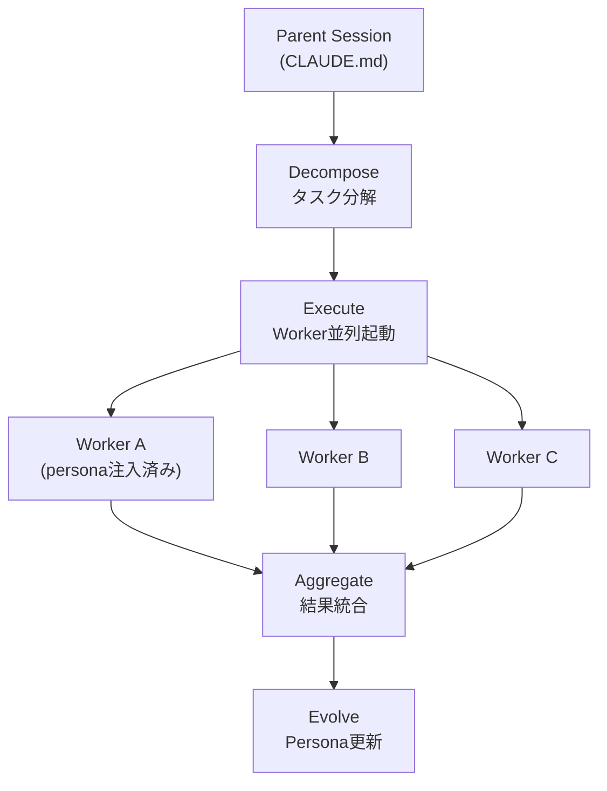

# TANEBI（種火）

> 種火 — 小さな火種から、消えない炎へ。
> The spark that never dies — agents that grow with every task.

**進化するマルチエージェント人格フレームワーク**

TANEBIは、エージェントにタスク実行を重ねるたびに成長・特化する「人格」を与え、チーム全体を複利的に賢くするフレームワークです。

## Quick Start

```bash
git clone https://github.com/skaji18/tanebi
cd tanebi
claude
```

これだけ。tmux不要、プロセス管理不要、追加インフラ不要。Claude Codeさえあれば動きます。

## TANEBIを使うと何が変わるか

| 段階 | 説明 |
|------|------|
| **素のClaude Code** | 1セッション。記憶なし。毎回ゼロスタート |
| **Claude Code + Task tool** | サブエージェント起動可能だが、人格なし・進化なし |
| **TANEBI** | 進化する人格 + Few-Shot自動注入 + 適応度ベース配置 |

## 核心機能

- **4層人格モデル** — Identity / Knowledge / Behavior / Performance をYAMLで定義・永続化
- **二重進化エンジン** — 個体進化（エージェントの成長）+ 知識進化（チームの学習）
- **Few-Shot Bank** — 成功事例が自動蓄積され、次のWorkerに自動注入
- **Persona Library** — 人格のコピー・合成・バージョン管理
- **プラガブルモジュール** — Trust, 認知品質, 通信最適化等を後付け可能
- **アダプター層** — claude-native / distributed / docker / cloud 等、環境を選ばない

## 仕組み



## ディレクトリ構成

```
tanebi/
  CLAUDE.md              # オーケストレーター指示書
  config.yaml            # 設定
  personas/
    active/              # 現在のPersona群
    library/             # テンプレート・スナップショット
    history/             # バージョン履歴
  knowledge/
    few_shot_bank/       # 成功事例ライブラリ
    episodes/            # エピソード記憶
  work/                  # タスク作業ディレクトリ
  templates/             # Worker/Decomposer/Aggregatorテンプレート
  scripts/               # 進化ループ・Persona操作スクリプト
  modules/               # プラガブルモジュール
  docs/                  # 設計ドキュメント
```

## ドキュメント

- [設計書](docs/design.md) — アーキテクチャ全体像、人格定義、進化エンジン、MVP仕様

## ステータス

> **WIP** — 設計フェーズ完了。MVP実装準備中。

## License

TBD
