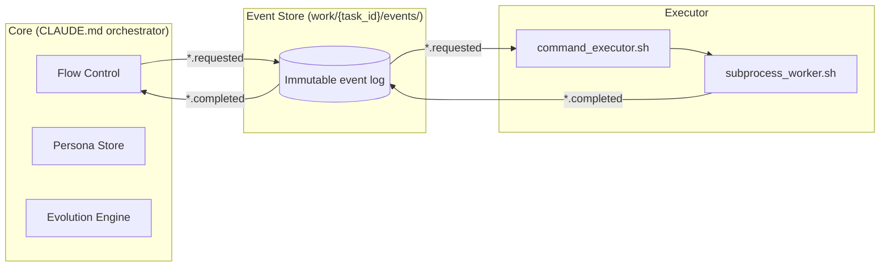

<p align="center">
  <strong>TANEBI</strong><br/>
  <em>Evolving Multi-Agent Persona Framework</em><br/>
  <em>( 進化するマルチエージェント人格フレームワーク )</em>
</p>

<p align="center">
  
  
  
</p>

---

> **The spark that never dies** -- agents that grow with every task.

In conventional multi-agent systems, agents are disposable: their memory resets every session, and the 100th task starts with the same capability as the first. **TANEBI** changes this by giving each agent a persistent **Persona** that evolves through task execution. Success patterns are reinforced, failure patterns are recorded, and the entire team becomes compoundingly smarter over time.

## Prerequisites

- **Python >= 3.10**
- **Claude Code CLI** (`claude` command) — [Install](https://claude.ai/code)
- **Anthropic API Key** — set as `ANTHROPIC_API_KEY` environment variable
- **Git**
- **macOS or Linux**

## Quick Start

```bash
git clone https://github.com/skaji18/tanebi
cd tanebi
bash scripts/setup.sh
claude
```

`setup.sh` installs the Python package and initializes seed Personas. `CLAUDE.md` auto-loads and TANEBI starts as your orchestrator. No tmux, no process managers, no extra infrastructure -- just Claude Code.

## Architecture

TANEBI separates **Core** (Evolution Engine + Persona management + flow control) from **Executor** (task execution environment) via the **Event Store**. Core and Executor never interact directly -- all communication flows through the immutable event log.


```mermaid
graph LR
    subgraph Core ["Core (CLAUDE.md orchestrator)"]
        O[Flow Control]
        P[Persona Store]
        E[Evolution Engine]
    end
    subgraph ES ["Event Store (work/{task_id}/events/)"]
        EL[(Immutable event log)]
    end
    subgraph EX ["Executor"]
        CMD[command_executor.sh]
        WRK[subprocess_worker.sh]
    end
    O -- "*.requested" --> EL
    EL -- "*.requested" --> CMD
    CMD --> WRK
    WRK -- "*.completed" --> EL
    EL -- "*.completed" --> O
```

**4-phase loop per task (DECOMPOSE → EXECUTE → AGGREGATE → EVOLVE)**. Each cycle makes the team stronger.

## Directory Structure

```
tanebi/
  CLAUDE.md              # Orchestrator (auto-loaded by Claude Code)
  config.yaml            # Framework configuration
  pyproject.toml         # Python package definition

  src/
    tanebi/              # Python package
      cli/               # CLI entrypoint
      core/              # Evolution engine, Persona Store, EventStore
      executor/          # Executor reference implementation

  personas/
    active/              # Live Personas (YAML)
    library/             # Starter templates (seeds/)
    history/             # Auto-snapshots every 5 tasks

  knowledge/
    few_shot_bank/       # Successful examples by domain
    episodes/            # Episode memory

  work/                  # Task workspaces (work/cmd_001/, ...)
  templates/             # Decomposer / Worker / Aggregator templates
  scripts/               # Evolution engine & utility scripts
  docs/                  # Design documents
```

## Persona Evolution

The heart of TANEBI. Every agent carries a **4-layer Persona**:

| Layer | Contains | Changes |
|-------|----------|---------|
| **Identity** | Name, speech style, archetype | Monthly |
| **Knowledge** | Domain proficiency, Few-Shot examples, anti-patterns | Every task |
| **Behavior** | Risk tolerance, detail orientation, speed vs quality | Every few tasks |
| **Performance** | Trust score, success rate, quality average, streaks | Every task |

TANEBI runs **dual evolution**:

- **Individual Evolution** -- Agent Personas evolve through selection, mutation, crossover, and fitness evaluation
- **Knowledge Evolution** -- A shared Few-Shot Bank accumulates successful examples. New workers automatically receive relevant past successes

The fitness function drives task-persona matching:

```
fitness = 0.35 * quality + 0.30 * completion + 0.20 * efficiency + 0.15 * growth
```

Agents that perform well get more tasks in their domain. Agents that struggle receive corrective feedback baked into their Persona. The team self-optimizes.

## Documentation

- **[Design Document](docs/design.md)** -- Full architecture specification, Persona schema, Evolution Engine details, Store abstractions, and event-driven architecture
- **[Executor Guide](docs/adapter-guide.md)** -- Executor environment implementation guide (Event Store schema compliant)
- **[Implementation Roadmap](docs/roadmap.md)** -- Python migration roadmap with phased plan

### 読者別ガイド
- **TANEBIを使う方**: このREADME → `bash scripts/setup.sh` → docs/design.md
- **Executorを実装する方**: docs/adapter-guide.md
- **TANEBIコアに貢献する方**: docs/design.md + docs/roadmap.md

## License

MIT
