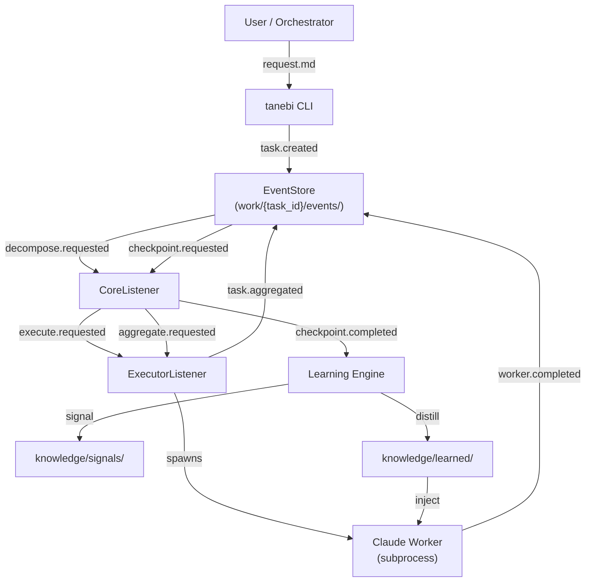
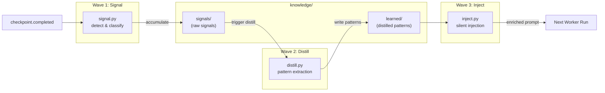

<p align="center">
  <strong>TANEBI</strong><br/>
  <em>Knowledge-Accumulating Multi-Agent Task Execution Framework</em><br/>
  <em>( 知識蓄積型マルチエージェントタスク実行フレームワーク )</em>
</p>

<p align="center">
  
  
  
</p>

---

> **The spark that never dies** -- agents that grow smarter with every task.

In conventional multi-agent systems, agents are disposable: their knowledge resets every session, and the 100th task starts with the same capability as the first. **TANEBI** changes this by running a **Learning Engine** that accumulates knowledge from every task. Success patterns are distilled, failure patterns are recorded, and the entire team's workers automatically receive enriched context on the next run.

## Prerequisites

- **Python >= 3.10**
- **Claude Code CLI** (`claude` command) — [Install](https://claude.ai/code)
- **Anthropic API Key** — set as `ANTHROPIC_API_KEY` environment variable
- **Git**
- **macOS or Linux**

## Quick Start

```bash
git clone https://github.com/skaji18/tanebi
cd tanebi
bash scripts/setup.sh
.venv/bin/tanebi --version   # tanebi 0.1.0
export ANTHROPIC_API_KEY=your_api_key_here  # https://console.anthropic.com/
claude
```

`setup.sh` installs the Python package and creates runtime directories. `CLAUDE.md` auto-loads and TANEBI starts as your orchestrator. No tmux, no process managers, no extra infrastructure -- just Claude Code.

## CLI Commands

| Command | Description |
|---------|-------------|
| `tanebi new` | Submit a new task |
| `tanebi status` | Show task status |
| `tanebi listener` | Manage the listener process |
| `tanebi emit` | Emit an event to the Event Store |
| `tanebi config` | Show current configuration |

## Architecture

TANEBI separates **Core** (flow control + Learning Engine) from **Executor** (task execution) via the **Event Store**. Core and Executor never interact directly -- all communication flows through the immutable event log.


```mermaid
graph TD
    User["User / Orchestrator"] -->|request.md| Tanebi["tanebi CLI"]
    Tanebi -->|task.created| EventStore["EventStore\n(work/{task_id}/events/)"]
    EventStore -->|decompose.requested| CL["CoreListener"]
    CL -->|execute.requested| EL["ExecutorListener"]
    EL -->|spawns| Worker["Claude Worker\n(subprocess)"]
    Worker -->|worker.completed| EventStore
    EventStore -->|checkpoint.requested| CL
    CL -->|checkpoint.completed| LE["Learning Engine"]
    LE -->|signal| Knowledge["knowledge/signals/"]
    LE -->|distill| Learned["knowledge/learned/"]
    Learned -->|inject| Worker
    CL -->|aggregate.requested| EL
    EL -->|task.aggregated| EventStore
```

**5-phase loop per task: DECOMPOSE → EXECUTE → [CHECKPOINT] → AGGREGATE → LEARN**. CHECKPOINT is optional. Each cycle feeds the Learning Engine, making future workers smarter.

## Learning Engine

The heart of TANEBI. After each checkpoint, the Learning Engine runs a three-wave pipeline that extracts knowledge from task outcomes and silently injects it into future workers.


```mermaid
graph LR
    subgraph Wave1 ["Wave 1: Signal"]
        W1["signal.py\ndetect & classify"]
    end
    subgraph Wave2 ["Wave 2: Distill"]
        W2["distill.py\npattern extraction"]
    end
    subgraph Wave3 ["Wave 3: Inject"]
        W3["inject.py\nsilent injection"]
    end
    subgraph KB ["knowledge/"]
        S["signals/\n(raw signals)"]
        L["learned/\n(distilled patterns)"]
    end

    checkpoint.completed --> W1
    W1 -->|accumulate| S
    S -->|trigger distill| W2
    W2 -->|write patterns| L
    L --> W3
    W3 -->|enriched prompt| NextWorker["Next Worker Run"]
```

Workers are unaware of the injection — they simply receive enriched context as part of their normal prompt. Knowledge compounds automatically.

## Directory Structure

```
tanebi/
  CLAUDE.md              # Orchestrator (auto-loaded by Claude Code)
  config.yaml            # Framework configuration
  pyproject.toml         # Python package definition

  src/
    tanebi/              # Python package
      cli/               # CLI entrypoint
      core/              # CoreListener, Learning Engine (signal/distill/inject), flow control
      executor/          # ExecutorListener, subprocess worker
      event_store/       # Immutable event log abstraction

  knowledge/
    signals/             # Raw signals from worker/checkpoint events (per domain)
    learned/             # Distilled patterns injected into workers (per domain)
    few_shot_bank/       # Successful examples by domain
    episodes/            # Episode memory
    _meta/               # Metadata (distillation state, counters)

  work/                  # Task workspaces (work/cmd_001/, ...)
  templates/             # Decomposer / Worker / Aggregator / Checkpoint templates
  scripts/               # Utility scripts
  docs/                  # Design documents
```

## Documentation

| Document | Description |
|----------|-------------|
| **[Getting Started](docs/getting-started.md)** | Installation and first task walkthrough |
| **[Design Document](docs/design.md)** | Full architecture specification, Learning Engine details, EventStore abstractions, and event-driven architecture |
| **[Executor Design](docs/executor-design.md)** | Executor implementation guide |

### Reader's Guide
- **New users**: README → docs/getting-started.md → docs/design.md
- **Executor implementors**: docs/executor-design.md
- **Core contributors**: docs/design.md

### Task Input Examples

After running `claude`, enter a task at the prompt:

```
> FizzBuzz を実装してください（1から100まで）
> src/ 以下のユニットテストをすべて書いてください
> README.md の誤字を修正してください
```

## License

MIT
