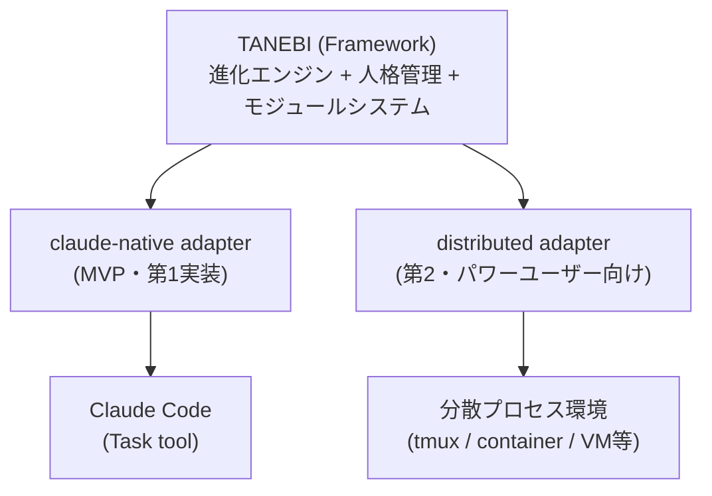
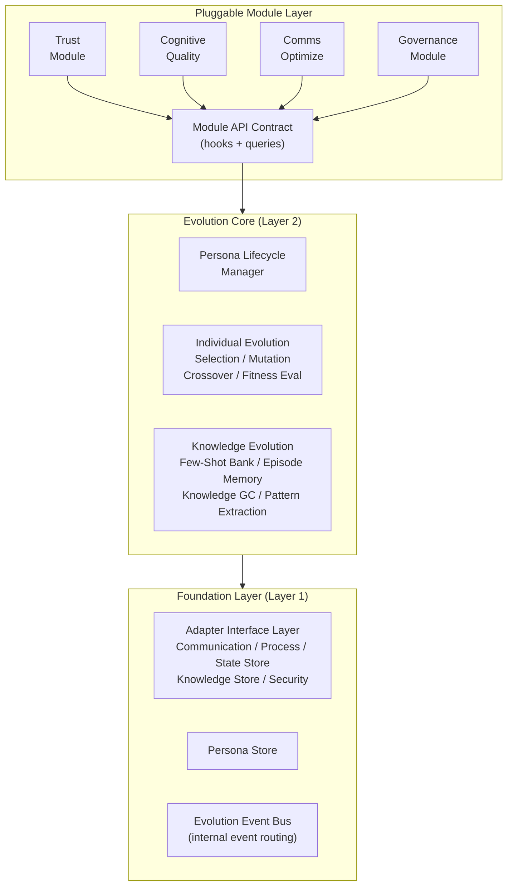
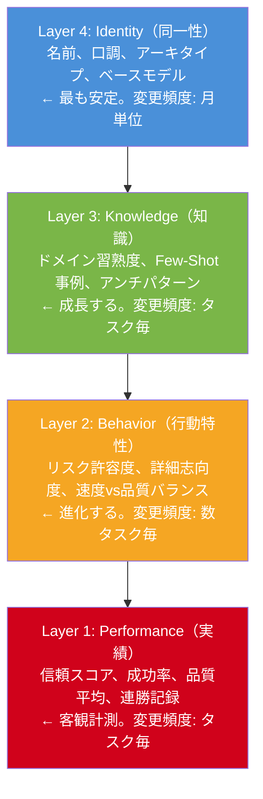
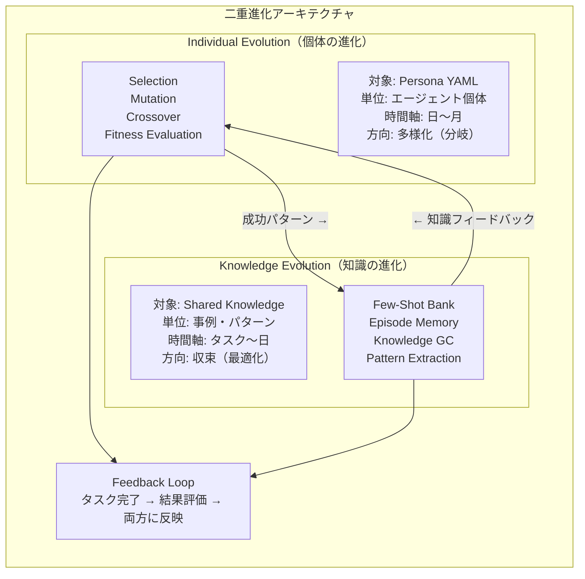
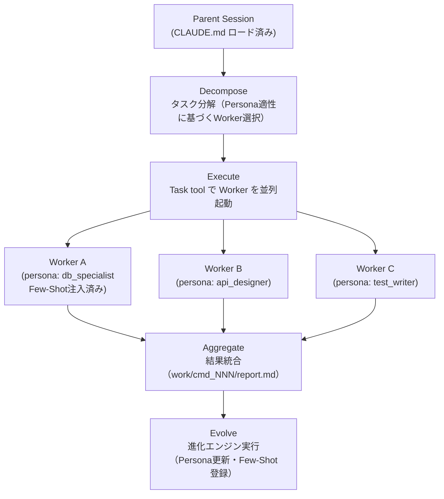

# TANEBI（種火）— 進化するマルチエージェント人格フレームワーク 設計書

---

## 1. TANEBIとは

### 1.1 ビジョン

```
種 火 — 小さな火種から、消えない炎へ。
The spark that never dies — agents that grow with every task.
```

TANEBIは**進化するマルチエージェント人格フレームワーク**である。

マルチエージェントシステムにおいて、エージェントは通常「使い捨ての作業者」として扱われる。セッションが終われば記憶は消え、100回目のタスクでも1回目と同じ能力で始まる。TANEBIはこの常識を覆す。

**TANEBIの核心**: エージェントにタスク実行を重ねるたびに成長・特化する「人格」を与え、チーム全体を複利的に賢くする。

### 1.2 名前の由来

「種火（たねび）」— 最初は微弱な火だが、燃料（タスク実行データ）を与え続けると消えない炎になる。複利型成長の本質を一語で表現する。

### 1.3 TANEBIが解決する問題

| 問題 | 現状 | TANEBIの解法 |
|------|------|-------------|
| **エージェントの記憶喪失** | セッション毎にリセット。過去の成功・失敗から学べない | 4層人格モデルで知識・行動特性・実績を永続化 |
| **最適配置の不在** | 誰にどのタスクを振るかは人間の勘 | 適応度スコアに基づく自動マッチング |
| **品質の停滞** | 100回やっても品質が上がらない | 進化エンジンが成功パターンを強化、失敗パターンを記録 |
| **知識のサイロ化** | エージェント間で成功事例が共有されない | 共有知識バンクとパターン抽出で組織学習 |
| **環境ロックイン** | 特定の実行環境に依存し、移植不可能 | アダプター層で実行環境を抽象化 |

### 1.4 TANEBIの始め方

```bash
git clone https://github.com/skaji18/tanebi
cd tanebi
claude
# CLAUDE.mdが自動ロード → TANEBIオーケストレーターとして起動
# ユーザーがタスクを伝える → Task toolでWorker起動 → 進化
```

**これだけ。** tmux不要、プロセス管理不要、追加インフラ不要。Claude Codeさえあれば動く。

### 1.5 既存システムとの関係

TANEBIは**特定の実行環境に依存しない汎用フレームワーク**である。



- **claude-native adapter（MVP）**: Claude Code の Task tool をベースとしたゼロインフラ実装。`git clone → cd tanebi → claude` で起動。**TANEBIの最初の実装**
- **distributed adapter（パワーユーザー向け）**: プロセス分散型の長期稼働・真の並行マルチエージェント。大規模プロジェクト・長時間運用向けの第2アダプター
- **その他**: Docker Compose、Kubernetes、単一セッションなど、アダプターさえ書けばどこでも動く

### 1.6 TANEBIを使うと何が変わるか

TANEBIが既存のマルチエージェント手法に対してどのような価値を追加するかを、3段階で比較する。

| 段階 | 説明 |
|------|------|
| **素のClaude Code** | 1セッション。記憶なし。毎回ゼロスタート |
| **Claude Code + Task tool（手動マルチエージェント）** | サブエージェント起動可能だが、人格なし・進化なし・毎回手動で構成 |
| **TANEBI** | 進化する人格 + Few-Shot自動注入 + 適応度ベース配置 + プラガブルモジュール |

**TANEBIの本質的差別化**: 従来のマルチエージェント手法は「タスクを効率よく実行する」仕組み。TANEBIは「タスクを実行するたびにチーム全体が賢くなる」フレームワーク。

---

## 2. コアアーキテクチャ

### 2.1 設計原則

| # | 原則 | 根拠 |
|---|------|------|
| P1 | **進化をコアに、他は交換可能** | 進化する知性を核に据える |
| P2 | **モジュールは差し替え可能** | 信頼・認知工学・UX等は後から差し込める |
| P3 | **方向性を早期に絞らない** | どの方向にも行ける状態を維持 |
| P4 | **認知工学は基盤レイヤーへ** | 注意品質管理を基盤に配置 |
| P5 | **制度設計はモジュールとして** | ガバナンス・信頼をプラグインに |
| P6 | **測定に基づく設計判断** | エビデンスベースの進化 |
| P7 | **二重進化（個体＋知識）** | 個体進化と共有知識進化の統合 |

### 2.2 レイヤー構成

TANEBIは3層＋プラガブルモジュール層で構成される。**実行環境固有の要素は一切含まない。**



### 2.3 各レイヤーの責務

#### Layer 1: Foundation（基盤層）

変更頻度が最も低く、信頼性が最も高い層。外部環境との接点はすべてアダプター経由。

| コンポーネント | 責務 | claude-native実装 |
|--------------|------|------------------|
| **Adapter Interface Layer** | 5種のアダプターを通じて実行環境と接続。詳細はSection 3で定義 | 下表参照 |
| **Persona Store** | 人格YAMLの読み書き・バージョン管理。アダプター経由で永続化先を選択 | `personas/` ディレクトリ（ファイルベース） |
| **Evolution Event Bus** | タスク完了・進化イベントを内部ルーティング。モジュールとEvolution Coreを疎結合に接続 | 親セッション内の逐次フロー（Task tool戻り値で連鎖） |

**claude-native アダプターのFoundation層マッピング:**

| アダプター種別 | claude-native実装 | 備考 |
|--------------|------------------|------|
| Communication Adapter | Task tool（Claude Code標準機能） | 親がWorkerにプロンプト注入、Workerが結果をreturn |
| Process Adapter | Task toolの並列呼び出し | 同一Wave内タスクを同時起動 |
| State Store Adapter | ファイルベース（`work/` ディレクトリ） | YAML/JSON/Markdown |
| Knowledge Store Adapter | ファイルベース（`personas/` + `knowledge/`） | Persona YAML + Few-Shot Bank |
| Security Adapter | Claude Codeのpermissions設定（標準機能） | `--allowedTools` / `.claude/settings.json` |

#### Layer 2: Evolution Core（進化コア）

TANEBIの心臓部。「使えば使うほど賢くなる」を実現するエンジン。**どの実行環境でも共通のロジック。**

| コンポーネント | 責務 |
|--------------|------|
| **Individual Evolution** | エージェント個体の人格進化（選択・突然変異・交叉・適応度評価） |
| **Knowledge Evolution** | 共有知識ベースの成長（Few-Shot蓄積・エピソード記録・知識GC） |
| **Persona Lifecycle Manager** | 人格の生成・コピー・合成・バージョン管理 |

#### Pluggable Module Layer（差し替え可能モジュール層）

各モジュールは独立して追加・削除・差し替えが可能。原則P3「方向性を絞らない」を構造的に保証する。

| モジュール | 機能 |
|-----------|------|
| Trust Module | 信頼スコアに基づく段階的権限委譲 |
| Cognitive Quality Module | 注意品質管理、コンテキスト劣化検知 |
| Communication Optimization | 通信トポロジーの最適化、情報密度制御 |
| Governance Module | エージェント間の合意形成、ガバナンス |

---

## 3. アダプターインターフェース定義

TANEBIと実行環境をつなぐ5種のアダプターを定義する。各アダプターは3-4メソッドの簡潔なインターフェースを持つ。

> 詳細な型定義・メソッド仕様は [docs/adapter-interface.md](adapter-interface.md) を参照。

### 3.1 概要

| アダプター | 責務 | claude-native実装 | distributed実装 |
|-----------|------|-------------------|----------------|
| **Communication** | エージェント間メッセージング | Task tool（プロンプト注入 + 戻り値） | メッセージブローカー |
| **Process** | エージェント起動・監視・停止 | Task toolの並列呼び出し | プロセスマネージャー |
| **State Store** | タスク・状態の永続化 | ファイルベース（`work/`） | KVS / ファイルベース |
| **Knowledge Store** | 人格・知識の永続化と検索 | ファイルベース（`personas/` + `knowledge/`） | 永続KVS / ベクトルDB |
| **Security** | 外部操作の検閲・承認 | Claude Code permissions | ポリシーエンジン |

### 3.2 アダプター構成例

```yaml
# config.yaml — claude-native（MVP）
tanebi:
  version: "1.0"
  adapter_set: "claude-native"

  adapters:
    communication:
      type: "claude-native"
    process:
      type: "claude-native"
    state_store:
      type: "file"
    knowledge_store:
      type: "file"
    security:
      type: "claude-permissions"

  adapter_config:
    claude-native:
      work_dir: "work"
      persona_dir: "personas/active"
      knowledge_dir: "knowledge"
      few_shot_dir: "knowledge/few_shot_bank"
      episode_dir: "knowledge/episodes"
      max_parallel_workers: 5
      worker_max_turns: 30
      default_model: "sonnet"
```

---

## 4. エージェント人格の技術定義

### 4.1 人格の構成要素

エージェント人格（Persona）を4層で定義する。



#### Persona YAMLスキーマ

```yaml
# personas/agent_alpha_v3.yaml
persona:
  id: "agent_alpha_v3"
  base_model: "claude-sonnet-4-6"
  version: 3
  created_at: "2026-03-01T12:00:00"
  parent_version: "agent_alpha_v2"
  lineage: ["agent_alpha_v1", "agent_alpha_v2"]

  identity:
    name: "鉄壁のDB職人"
    speech_style: "冷静沈着"
    archetype: specialist     # specialist | generalist | hybrid
    origin: evolved           # seeded | copied | merged | evolved

  knowledge:
    domains:
      - name: database_design
        proficiency: 0.87
        task_count: 42
        last_updated: "2026-03-15"
      - name: api_design
        proficiency: 0.65
        task_count: 15
        last_updated: "2026-03-10"
    few_shot_refs:
      - "episodic:db:task042_migration_success"
      - "episodic:db:task067_index_optimization"
    anti_patterns:
      - pattern: "N+1クエリの見落とし"
        detected_count: 3
        correction: "JOINまたはeager loadを明示的に検討"

  behavior:
    risk_tolerance: 0.4
    detail_orientation: 0.85
    speed_vs_quality: 0.3
    autonomy_preference: 0.6
    communication_density: 0.7

  performance:
    trust_score: 72
    total_tasks: 57
    success_rate: 0.89
    avg_quality: GREEN
    specialization_index: 0.75
    streak:
      current: 5
      best: 12
    domain_success_rates:
      database_design: 0.95
      api_design: 0.80
      frontend: 0.45

  evolution:
    generation: 3
    fitness_score: 0.82
    last_evolution_event:
      type: trait_reinforcement
      field: detail_orientation
      delta: +0.05
      trigger: "task_089: 詳細レビューで品質向上を確認"
      timestamp: "2026-03-15T14:00:00"
    mutations_log:
      - { gen: 1, type: seed, note: "初期シード" }
      - { gen: 2, type: reinforcement, field: "database_design.proficiency", delta: +0.12 }
      - { gen: 3, type: reinforcement, field: "detail_orientation", delta: +0.05 }
    crossover_history: []
```

### 4.2 粒度の定義

| 粒度 | 用途 | 含む層 | サイズ目安 |
|------|------|-------|----------|
| **Full** | 完全バックアップ・移植 | Layer 1-4 全て + Evolution Metadata | ~200行 YAML |
| **Portable** | 他エージェントへのコピー・合成 | Layer 2-4（Performance除外） | ~100行 YAML |
| **Seed** | 新エージェント初期化用 | Layer 4 + Behavior初期値のみ | ~30行 YAML |

**Portable粒度がPerformanceを除外する理由**: 信頼スコアや成功率は「そのエージェントがその環境で積んだ実績」であり、別のエージェントにコピーすべきでない。信頼は自分で獲得するものである。

### 4.3 ポータビリティの仕様

> 詳細な操作仕様（コピー・合成・ライブラリ・バージョン管理）は [docs/persona-operations.md](persona-operations.md) を参照。

- **コピー（Clone）**: Portable粒度で複製。Performanceは白紙スタート
- **合成（Merge）**: 2体の人格を加重結合。新しい人格を生成（非破壊操作）
- **共有（Persona Library）**: `personas/library/` にテンプレート/スナップショットを蓄積
- **バージョン管理**: 5タスクごとに自動スナップショット。`personas/history/` に保存

---

## 5. 進化エンジン詳細

### 5.1 二重進化の統合設計

個体進化（Individual Evolution）と知識進化（Knowledge Evolution）を統合した二重進化アーキテクチャ。



**統合のメカニズム**:

1. **タスク完了時**（毎回）: Persona YAML更新 + Few-Shot Bank登録
2. **成功パターン検出時**: 特性のreinforcement + 共有知識に追加
3. **失敗検出時**: 特性のcorrection + anti_pattern追加 + ネガティブ事例登録
4. **月次進化イベント**: トップパフォーマーのCrossover + 世代別GC

### 5.2 適応度関数（Fitness Function）

```yaml
fitness_function:
  formula: |
    fitness = w1 * quality_score + w2 * completion_rate + w3 * efficiency + w4 * growth_rate

  weights:
    w1: 0.35    # 品質スコア（GREEN=1.0, YELLOW=0.5, RED=0.0）
    w2: 0.30    # タスク完了率
    w3: 0.20    # 効率（期待所要時間 / 実所要時間）
    w4: 0.15    # 成長率（直近10タスクのfitness変化率）

  window: 20    # 直近20タスクのスライディングウィンドウ
```

### 5.3 進化の速度（仮説）

| フェーズ | タスク数 | 期待される変化 |
|---------|---------|-------------|
| **分化期** | 0-50 | ドメイン習熟度に差が出始める |
| **特化期** | 50-200 | specialization_indexが0.5超のエージェントが出現 |
| **安定期** | 200+ | 各エージェントのニッチが確立。交叉が主な進化源 |

> 進化メカニズムの詳細（選択・突然変異・交叉の仕様）は [docs/evolution-engine.md](evolution-engine.md) を参照。

---

## 6. プラガブルモジュール

### 6.1 モジュールインターフェース（API Contract）

全モジュールは以下のフックを実装する:

| フック | タイミング | 用途例 |
|--------|---------|--------|
| `on_init` | システム起動時 | モジュール初期化 |
| `on_task_assign` | タスク割り当て直前 | Trust Moduleが信頼スコア不足でblock |
| `on_task_complete` | タスク完了後 | Trust Moduleがスコア更新 |
| `on_session_start` | エージェントセッション開始時 | Cognitive Moduleがコンテキスト品質管理指示を注入 |
| `on_message_send` | メッセージ送信前 | Comms Moduleが情報密度を検証・圧縮 |

### 6.2 モジュール一覧

| モジュール | 優先度 | 状態 |
|-----------|--------|------|
| Trust Module | MVP内 | Week 3-4で実装 |
| Cognitive Quality Module | 次フェーズ | 設計のみ |
| Communication Optimization | 次フェーズ | 設計のみ |
| Governance Module | 将来 | コンセプトのみ |

---

## 7. MVP仕様（claude-native アダプター実装）

### 7.1 全体方針

MVPは「**claude-native アダプターを使ったTANEBIの最初の実装**」として定義する。`git clone → cd tanebi → claude` で動く、ゼロインフラの起動体験を最優先する。

**MVPの定義**: 「進化が始まる」最小状態。4週間後に「エージェントが育っている兆候」を観測可能にする。

### 7.2 実行モデル



### 7.3 4週間ロードマップ

| Week | テーマ | 主な成果物 |
|------|--------|----------|
| **1** | コア骨格 | CLAUDE.md、Persona YAMLスキーマ、初期Seed 2-3種、config.yaml |
| **2** | 進化ループ基礎 | Worker テンプレート、Decompose→Execute→Aggregateフロー、Few-Shot Bank、evolve.sh |
| **3** | 進化エンジン本体 | 適応度関数、Few-Shot自動登録、Persona自動更新、persona_ops.sh |
| **4** | 統合・検証 | E2Eテスト、Trust Module最小実装、進化可視化、ドキュメント |

---

## 8. 将来のアダプター候補

| アダプター | 特徴 | 適合シーン |
|-----------|------|-----------|
| **distributed** | 真の並行性、長期稼働、非同期協調 | 大規模プロジェクト、パワーユーザー |
| **docker** | スケーラビリティ、環境再現性 | チーム開発、本番デプロイ |
| **single** | セットアップ不要、1セッション完結 | プロトタイピング、チュートリアル |
| **cloud** | 完全マネージド、自動スケーリング | 企業導入、SaaS化 |

### アダプター選択ガイド

| 基準 | claude-native (MVP) | distributed | docker | single | cloud |
|------|---------------------|-------------|--------|--------|-------|
| セットアップ容易性 | ◎ | △ | △ | ◎ | △ |
| 並行性 | ○ | ◎ | ◎ | × | ◎ |
| 長期稼働 | △ | ◎ | ◎ | × | ◎ |
| スケーラビリティ | △ | △ | ◎ | × | ◎ |

---

## 付録: ビジョンとMVPの対照表

| 機能 | MVPで作るもの | 将来ビジョン |
|------|-------------|-------------|
| **個体進化** | reinforcement（成功→強化） | mutation, crossover, niche differentiation |
| **知識進化** | Few-Shot Bank（ファイルベース） | ベクトルDB、RAG自動検索 |
| **人格管理** | YAMLファイル + コピー手順書 | Web UI、自動合成、ライブラリカタログ |
| **モジュール** | Trust Module 1つ | 4+モジュール |
| **観測** | ファイルベースKPI | リアルタイムWeb UI、レーダーチャート |
| **アダプター** | claude-native 1種 | distributed, docker, single, cloud |
