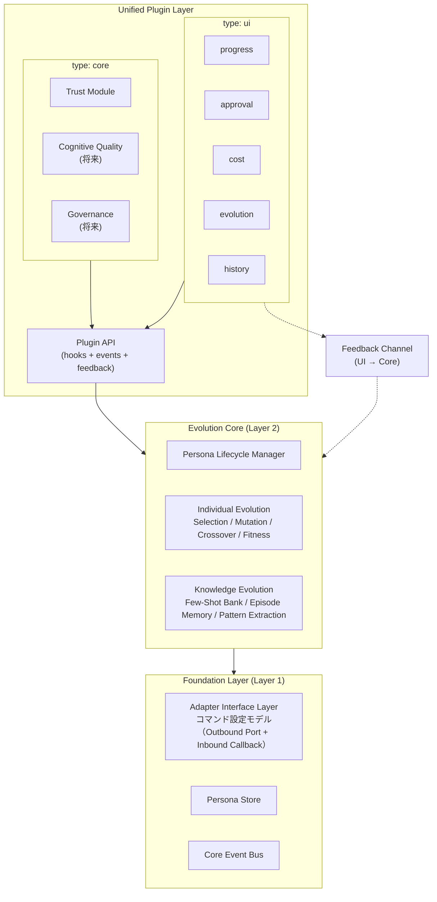
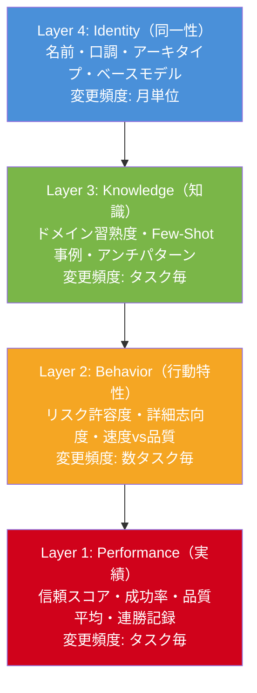
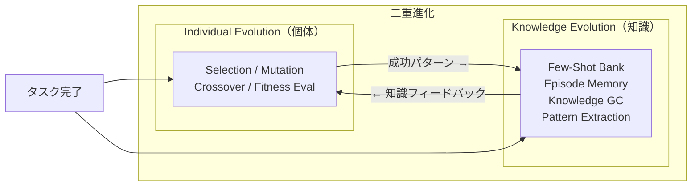

# TANEBI（種火）設計書

---

## 1. 思想・設計ポリシー

### 1.1 コア価値：進化する人格

```
種 火 — 小さな火種から、消えない炎へ。
The spark that never dies — agents that grow with every task.
```

TANEBIは**進化するマルチエージェント人格フレームワーク**である。エージェントにタスク実行を重ねるたびに成長・特化する「人格（Persona）」を与え、チーム全体を複利的に賢くする。

| 問題 | TANEBIの解法 |
|------|-------------|
| エージェントの記憶喪失 | 4層人格モデルで知識・行動特性・実績を永続化 |
| 最適配置の不在 | 適応度スコアに基づく自動マッチング |
| 品質の停滞 | 進化エンジンが成功パターンを強化、失敗パターンを記録 |
| 知識のサイロ化 | 共有知識バンクとパターン抽出で組織学習 |
| 環境ロックイン | アダプター層で実行環境を抽象化 |

### 1.2 コアとシェルの分離

TANEBIの設計は**コア（進化エンジン + Persona管理）とシェル（UI + アダプター）の分離**を原則とする。

- **コア層**: 進化エンジン、Persona Lifecycle Manager、統一プラグインシステム基盤。実行環境に依存しない。UIが0個でも動作する
- **シェル層**: アダプター（実行環境抽象化）と UIプラグイン（表示・操作）。自由に差し替え・追加・削除可能

**コアが強いからこそシェルを自由にできる。**

### 1.3 設計原則

| # | 原則 | 説明 |
|---|------|------|
| P1 | 進化をコアに、他は交換可能 | 進化する知性を核に据える |
| P2 | プラグインは差し替え可能 | 信頼・認知工学・UIは後から差し込める |
| P3 | 方向性を早期に絞らない | どの方向にも行ける状態を維持 |
| P4 | 測定に基づく設計判断 | エビデンスベースの進化 |
| P5 | 二重進化（個体＋知識） | 個体進化と共有知識進化の統合 |

### 1.4 ゼロインフラ原則

```bash
git clone https://github.com/skaji18/tanebi
cd tanebi
claude
# CLAUDE.mdが自動ロード → TANEBIオーケストレーターとして起動
```

Claude Codeさえあれば動く。tmux不要、プロセス管理不要、追加インフラ不要。

---

## 2. アーキテクチャ概要

### 2.1 3層 + 統一プラグイン層



### 2.2 各レイヤーの責務

#### Layer 1: Foundation（基盤層）

変更頻度が最も低く、信頼性が最も高い層。

| コンポーネント | 責務 | claude-native実装 |
|--------------|------|------------------|
| Adapter Interface Layer | コマンド設定モデルによるOutbound Port + Inbound Callback（Section 8） | config.yamlのコマンド定義 + command_executor.sh |
| Persona Store | 人格YAMLの読み書き・バージョン管理 | `personas/` ディレクトリ |
| Core Event Bus | イベントルーティング。プラグインとEvolution Coreを疎結合に接続 | ファイルベースイベントログ |

#### Layer 2: Evolution Core（進化コア）

TANEBIの心臓部。詳細は Section 7。

| コンポーネント | 責務 |
|--------------|------|
| Individual Evolution | エージェント個体の人格進化（選択・突然変異・交叉・適応度評価） |
| Knowledge Evolution | 共有知識ベースの成長（Few-Shot蓄積・エピソード記録・知識GC） |
| Persona Lifecycle Manager | 人格の生成・コピー・合成・バージョン管理 |

#### Unified Plugin Layer（統一プラグイン層）

Core PluginとUI Pluginを統一した規約で管理する。詳細は Section 3。

---

## 3. 統一プラグインシステム

### 3.1 共通のPlugin規約

全プラグインは `type` に関わらず、以下のファイル構成と規約に従う。

#### ディレクトリ構造

```
plugins/
├── trust/                  # type: core
│   ├── plugin.yaml         # プラグイン定義（必須）
│   ├── handler.sh          # フック/イベントハンドラ（必須）
│   └── config.yaml         # 設定（任意）
├── progress/               # type: ui
│   ├── plugin.yaml
│   ├── handler.sh
│   └── config.yaml
├── approval/
│   └── ...
├── cost/
│   └── ...
├── evolution/
│   └── ...
├── history/
│   └── ...
└── _template/              # テンプレート
    ├── plugin.yaml
    └── handler.sh
```

#### plugin.yaml（必須）

```yaml
plugin:
  name: "plugin_name"              # 一意の名前 [a-z_]+
  version: "1.0.0"                 # セマンティックバージョン
  type: core                       # core | ui
  description: "1行の説明"

  subscribes_to:                   # 購読するイベント
    - event_type: "worker.completed"
      handler: "on_worker_done"    # handler.sh内の関数名

  feedback_commands: []            # UI → Core フィードバック（type: ui のみ）

  lifecycle:
    on_init: "init"                # 初期化
    on_event: "handle_event"       # イベント受信
    on_destroy: "cleanup"          # 終了処理

  # type: core のみ
  hooks:                           # コア処理への介入ポイント
    on_task_assign: "check_trust"  # allow/deny 権限あり
    on_task_complete: "update_score"

  # type: ui のみ
  display:
    type: terminal                 # terminal | file | web
    refresh_mode: event_driven     # event_driven | polling | manual
```

#### handler.sh（必須）

```bash
#!/usr/bin/env bash

init() {
  echo "[$(basename "$(dirname "$0")")] initialized"
}

handle_event() {
  local event_type="$1"
  local event_file="$2"
  # イベント処理
}

cleanup() {
  :
}
```

#### config.yaml での有効/無効切り替え

```yaml
# config.yaml
tanebi:
  plugins:
    trust:
      enabled: true
    progress:
      enabled: true
    approval:
      enabled: true
      plan_review: true
      wave_gate: false
    cost:
      enabled: false
    evolution:
      enabled: true
    history:
      enabled: false
```

### 3.2 type: core（Core Plugin）

Core Pluginはタスク実行フローに**介入**できる。

| 権限 | 説明 |
|------|------|
| allow/deny | `on_task_assign` フックでタスク割り当てをブロック可能 |
| on_task_complete | タスク完了後にスコア更新等の処理を実行 |
| on_session_start | セッション開始時に制約を注入 |

**介入の仕組み**: Core Pluginのフックは exit code で判定する。exit 0 = allow、exit 1 = deny。deny時はオーケストレーターが代替策を実行する。

**現在のCore Plugin**:
- **Trust Module**: 信頼スコアに基づく段階的権限委譲（Section 5.1）

**将来のCore Plugin候補**:
- Cognitive Quality Module: 注意品質管理、コンテキスト劣化検知
- Governance Module: エージェント間の合意形成

### 3.3 type: ui（UI Plugin）

UI Pluginはイベントを購読して表示・操作を行う。コアの内部実装を知らない。

| 権限 | 説明 |
|------|------|
| イベント購読 | Core Event Bus からイベントを受信し表示 |
| Feedback Channel | コアに提案できるが**拒否権なし** |

**Feedback Channel**: UIからコアへの唯一の逆方向経路。型安全なコマンドのみ通過する。

```bash
# handler.sh内でフィードバックを送信
tanebi_feedback "approve_plan" '{"approved": true}'
```

**現在のUI Plugin**:
- progress / approval / cost / evolution / history（Section 5.2〜5.6）

### 3.4 プラグインライフサイクル

```
┌──────────┐
│ on_init  │ ← TANEBI起動時
└────┬─────┘
     ▼
┌──────────────────┐
│  Event Loop      │ ← Core Event Busからイベント受信
│  on_event(t, f)  │
└────┬─────────────┘
     │  (TANEBI停止時)
     ▼
┌────────────┐
│ on_destroy │
└────────────┘
```

Core PluginはEvent Loopに加え、hooksフィールドで定義されたフックがオーケストレーターから直接呼び出される。

---

## 4. イベント駆動アーキテクチャ

### 4.1 設計思想

TANEBIはイベントの**消費者**である。

- **イベントスキーマ**（名前・ペイロード構造）はTANEBIが定義する
- **誰が・どうやって発火するか**はアダプターの責務
- **デフォルト実装**（`scripts/emit_event.sh`）は提供するが、差し替え可能
- **transport層**（ファイル/Redis/WebSocket等）は関知しない

### 4.2 イベントカタログ

#### タスク実行イベント

| イベント名 | 発火タイミング | ペイロード |
|-----------|--------------|-----------|
| `task.created` | `new_cmd.sh` 実行後 | `{ cmd_id, request_summary, timestamp }` |
| `task.decomposed` | Decomposer完了後 | `{ cmd_id, plan: { subtasks[], waves, persona_assignments[] } }` |
| `worker.started` | Worker起動時 | `{ cmd_id, subtask_id, persona_id, wave }` |
| `worker.progress` | Worker中間出力時 | `{ cmd_id, subtask_id, message, percent? }` |
| `worker.completed` | Worker完了時 | `{ cmd_id, subtask_id, status, quality, domain }` |
| `wave.completed` | Wave内全Worker完了 | `{ cmd_id, wave, results_summary }` |
| `task.aggregated` | Aggregator完了後 | `{ cmd_id, report_path, quality_summary }` |

#### 進化イベント

| イベント名 | 発火タイミング | ペイロード |
|-----------|--------------|-----------|
| `evolution.started` | evolve.sh開始時 | `{ cmd_id }` |
| `evolution.persona_updated` | Persona更新時 | `{ persona_id, field, old_value, new_value, reason }` |
| `evolution.few_shot_registered` | Few-Shot登録時 | `{ domain, subtask_id, quality }` |
| `evolution.completed` | evolve.sh完了時 | `{ cmd_id, personas_updated[], few_shots_added }` |

#### システムイベント

| イベント名 | 発火タイミング | ペイロード |
|-----------|--------------|-----------|
| `trust.check` | Trust Module判定時 | `{ persona_id, task_risk, decision: allow/deny }` |
| `cost.token_used` | トークン消費推定時 | `{ cmd_id, subtask_id?, tokens_estimated }` |
| `error.worker_failed` | Worker失敗時 | `{ cmd_id, subtask_id, error_detail }` |
| `approval.requested` | 承認待ち時 | `{ cmd_id, approval_type, data, timeout_seconds? }` |

### 4.3 イベントペイロードスキーマ

```yaml
# events/schema.yaml
events:
  task.created:
    cmd_id: string
    request_summary: string
    timestamp: string         # ISO8601

  task.decomposed:
    cmd_id: string
    plan:
      subtasks: array
      waves: integer
      persona_assignments: array

  worker.completed:
    cmd_id: string
    subtask_id: string
    status: enum[success, failure]
    quality: enum[GREEN, YELLOW, RED]
    domain: string

  evolution.persona_updated:
    persona_id: string
    field: string             # e.g. "behavior.risk_tolerance"
    old_value: number
    new_value: number
    reason: string

  approval.requested:
    cmd_id: string
    approval_type: enum[plan_review, wave_gate, danger_op, budget_exceeded]
    data: object
    timeout_seconds: number?  # null = 無期限
```

### 4.4 Core Event Bus 実装（claude-native）

ファイルベースのイベントログとして実装する。

```
work/cmd_NNN/events/
├── 001_task.created.yaml
├── 002_task.decomposed.yaml
├── 003_worker.started.yaml
├── ...
└── 015_evolution.completed.yaml
```

各ファイルのフォーマット:

```yaml
event:
  id: "evt_003"
  type: "worker.started"
  timestamp: "2026-03-01T12:05:00Z"
  payload:
    cmd_id: "cmd_001"
    subtask_id: "subtask_001"
    persona_id: "backend_specialist_v2"
    wave: 1
```

イベント発火:

```bash
bash scripts/emit_event.sh <cmd_dir> <event_type> '<payload_yaml>'
```

### 4.5 Feedback Channel

UIからコアへの逆方向通信。

#### 許可されるフィードバックコマンド

| コマンド | 送信元 | コアの応答 |
|---------|--------|----------|
| `approve_plan` | approval | Execute開始 |
| `reject_plan` | approval | 修正指示付きで再Decompose |
| `modify_plan` | approval | サブタスク追加/削除/変更 |
| `approve_wave` | approval | 次Wave開始 |
| `abort_task` | approval | タスク全体を中止 |
| `adjust_parameter` | evolution | 行動パラメータの手動調整 |

#### Feedback Channel 実装（claude-native）

```
work/cmd_NNN/feedback/
├── fb_001_approve_plan.yaml
└── fb_002_approve_wave.yaml
```

```yaml
feedback:
  id: "fb_001"
  command: "approve_plan"
  timestamp: "2026-03-01T12:06:00Z"
  source_component: "approval"
  payload:
    approved: true
    modifications: []
```

claude-nativeではClaude Codeのユーザー対話フローをFeedback Channelとして利用する。

---

## 5. 各プラグイン仕様

### 5.1 Trust Module (type: core)

信頼スコアに基づく段階的権限委譲。

#### plugin.yaml

```yaml
plugin:
  name: "trust"
  version: "1.0.0"
  type: core
  description: "信頼スコアに基づく段階的権限委譲"

  subscribes_to:
    - event_type: "trust.check"
      handler: "log_trust_decision"

  lifecycle:
    on_init: "on_init"
    on_event: "handle_event"
    on_destroy: "cleanup"

  hooks:
    on_task_assign: "on_task_assign"
    on_task_complete: "on_task_complete"
```

#### handler動作

| フック | 入力 | 動作 | 出力 |
|--------|------|------|------|
| `on_init` | persona_yaml_path | trust_scoreが未設定なら50で初期化 | exit 0 |
| `on_task_assign` | persona_id, risk_level | trust_score < 30 かつ high-risk → deny | exit 0 (allow) / exit 1 (deny) |
| `on_task_complete` | persona_id, status, quality | スコア更新: GREEN +5, YELLOW +2, failure -10 | exit 0 |

#### 信頼スコアの更新ルール

| 結果 | delta |
|------|-------|
| success + GREEN | +5 |
| success + YELLOW | +2 |
| success + RED | +0 |
| failure | -10 |

スコア範囲: 0〜100。初期値: 50。

### 5.2 progress (type: ui)

Worker実行状況のリアルタイム表示。

#### plugin.yaml

```yaml
plugin:
  name: "progress"
  version: "1.0.0"
  type: ui
  description: "Worker実行状況のリアルタイム進捗表示"

  subscribes_to:
    - event_type: "task.decomposed"
      handler: "show_plan_summary"
    - event_type: "worker.started"
      handler: "mark_worker_active"
    - event_type: "worker.progress"
      handler: "update_worker_status"
    - event_type: "worker.completed"
      handler: "mark_worker_done"
    - event_type: "wave.completed"
      handler: "show_wave_summary"
    - event_type: "task.aggregated"
      handler: "show_final_summary"
    - event_type: "error.worker_failed"
      handler: "mark_worker_failed"

  feedback_commands: []

  display:
    type: terminal
    refresh_mode: event_driven
```

#### 表示例

```
━━━ TANEBI Progress: cmd_015 ━━━━━━━━━━━━━━━━━━━━━

Wave 1/3 ████████████████████ 100%
  ✅ subtask_001 (backend_specialist_v2) — GREEN
  ✅ subtask_002 (api_designer_v1)      — GREEN

Wave 2/3 ████████░░░░░░░░░░░░  40%
  🔄 subtask_004 (test_writer_v1)       — in progress
  ⏳ subtask_006 (docs_seed_v1)         — queued

Wave 3/3 ░░░░░░░░░░░░░░░░░░░░  waiting
━━━━━━━━━━━━━━━━━━━━━━━━━━━━━━━━━━━━━━━━━━━━━━━━━━━
```

#### 設定項目

| 項目 | デフォルト | 設定方法 |
|------|----------|---------|
| 出力フォーマット | ターミナルテーブル | `plugins/progress/config.yaml` |
| 表示する情報 | 全サブタスク | filter設定で絞り込み |
| 更新頻度 | イベント駆動 | polling に変更可 |

### 5.3 approval (type: ui)

計画承認ゲートと実行中の介入ポイント。

#### plugin.yaml

```yaml
plugin:
  name: "approval"
  version: "1.0.0"
  type: ui
  description: "計画承認ゲートと実行中介入ポイント"

  subscribes_to:
    - event_type: "task.decomposed"
      handler: "present_plan_for_approval"
    - event_type: "wave.completed"
      handler: "wave_gate_check"
    - event_type: "trust.check"
      handler: "show_trust_decision"
    - event_type: "approval.requested"
      handler: "handle_approval_request"

  feedback_commands:
    - command: "approve_plan"
      payload_schema: { approved: boolean, modifications: array? }
    - command: "reject_plan"
      payload_schema: { reason: string, retry: boolean }
    - command: "modify_plan"
      payload_schema: { changes: array }
    - command: "approve_wave"
      payload_schema: { wave: number, approved: boolean }
    - command: "abort_task"
      payload_schema: { reason: string }

  display:
    type: terminal
    refresh_mode: event_driven
```

#### 計画承認ゲート表示例

```
━━━ TANEBI Plan Review: cmd_015 ━━━━━━━━━━━━━━━━━━

📋 実行計画:

| # | サブタスク | Persona | Fitness | Wave |
|---|-----------|---------|---------|------|
| 1 | APIエンドポイント実装 | backend_specialist_v2 | 0.82 | 1 |
| 2 | ユニットテスト作成 | test_writer_v1 | 0.75 | 2 |

承認しますか？ [Y / n / modify]
━━━━━━━━━━━━━━━━━━━━━━━━━━━━━━━━━━━━━━━━━━━━━━━━
```

#### 設定項目

| 項目 | デフォルト | 設定キー |
|------|----------|---------|
| 計画承認 | 有効 | `plugins.approval.plan_review` |
| Wave間ゲート | 無効 | `plugins.approval.wave_gate` |
| 承認タイムアウト | 無期限 | `plugins.approval.timeout_seconds` |
| 危険操作確認 | 有効 | `plugins.approval.danger_op_confirm` |

### 5.4 cost (type: ui)

トークン消費量のトラッキングと表示。

#### plugin.yaml

```yaml
plugin:
  name: "cost"
  version: "1.0.0"
  type: ui
  description: "トークン消費量トラッキングと表示"

  subscribes_to:
    - event_type: "cost.token_used"
      handler: "accumulate_cost"
    - event_type: "worker.completed"
      handler: "finalize_subtask_cost"
    - event_type: "task.aggregated"
      handler: "show_task_cost_summary"
    - event_type: "evolution.completed"
      handler: "finalize_evolution_cost"

  feedback_commands:
    - command: "adjust_parameter"
      payload_schema: { key: "cost_budget", value: number }

  display:
    type: terminal
    refresh_mode: event_driven
```

#### コストサマリー表示例

```
━━━ TANEBI Cost Report: cmd_015 ━━━━━━━━━━━━━━━━━━

Token Usage (estimated):
  Decompose:  ~1,200 tokens
  Workers:    ~8,500 tokens
  Aggregate:  ~1,500 tokens
  Evolve:     ~300 tokens
  ─────────────────────
  Total:      ~11,500 tokens

Cumulative (this session): ~45,200 tokens
━━━━━━━━━━━━━━━━━━━━━━━━━━━━━━━━━━━━━━━━━━━━━━━━━━
```

#### データ永続化

```yaml
# work/cmd_NNN/cost.yaml
cost:
  cmd_id: "cmd_015"
  timestamp: "2026-03-01T12:30:00Z"
  breakdown:
    decompose: 1200
    workers:
      subtask_001: 2800
      subtask_002: 2200
    aggregate: 1500
    evolve: 300
  total: 11500
```

#### 設定項目

| 項目 | デフォルト | 設定キー |
|------|----------|---------|
| 予算上限 | 無制限 | `plugins.cost.budget` |
| サブタスク別表示 | 有効 | `plugins.cost.show_per_subtask` |
| 累計集計 | 有効 | `plugins.cost.show_cumulative` |

### 5.5 evolution (type: ui)

Persona進化状況・fitness推移の可視化。

#### plugin.yaml

```yaml
plugin:
  name: "evolution"
  version: "1.0.0"
  type: ui
  description: "Persona進化状況・fitness推移の可視化"

  subscribes_to:
    - event_type: "evolution.started"
      handler: "show_evolution_start"
    - event_type: "evolution.persona_updated"
      handler: "show_persona_change"
    - event_type: "evolution.few_shot_registered"
      handler: "show_few_shot_update"
    - event_type: "evolution.completed"
      handler: "show_evolution_summary"

  feedback_commands:
    - command: "adjust_parameter"
      payload_schema: { persona_id: string, field: string, value: number }

  display:
    type: terminal
    refresh_mode: event_driven
```

#### 進化サマリー表示例

```
━━━ TANEBI Evolution Report: cmd_015 ━━━━━━━━━━━━━━

Persona Updates:

  backend_specialist_v2:
    fitness:    0.80 → 0.82 (+0.02)
    tasks:      55 → 57
    success:    0.87 → 0.89
    streak:     3 → 5
    ▸ reinforced: detail_orientation +0.05

Few-Shot Bank:
    + backend/subtask_001 (GREEN) → registered
    Bank size: backend=12, testing=8, frontend=3
━━━━━━━━━━━━━━━━━━━━━━━━━━━━━━━━━━━━━━━━━━━━━━━━━━
```

#### 設定項目

| 項目 | デフォルト | 設定キー |
|------|----------|---------|
| 完了時サマリー表示 | 有効 | `plugins.evolution.show_on_complete` |
| 詳細表示 | 無効 | `plugins.evolution.verbose` |
| fitness推移表示 | 無効 | `plugins.evolution.show_fitness_trend` |

### 5.6 history (type: ui)

過去タスクの検索・閲覧。

#### plugin.yaml

```yaml
plugin:
  name: "history"
  version: "1.0.0"
  type: ui
  description: "過去タスクの検索・閲覧"

  subscribes_to:
    - event_type: "task.aggregated"
      handler: "index_completed_task"

  feedback_commands: []

  display:
    type: terminal
    refresh_mode: manual
```

#### インデックスファイル

```yaml
# work/index.yaml
tasks:
  - cmd_id: "cmd_015"
    date: "2026-03-01"
    request_summary: "APIエンドポイント実装"
    total_subtasks: 4
    succeeded: 4
    quality_summary: { GREEN: 3, YELLOW: 1, RED: 0 }
    domains: [backend, testing, docs]
    personas_used: [backend_specialist_v2, test_writer_v1, docs_seed_v1]
    cost_tokens: 11500
    report_path: "work/cmd_015/report.md"
```

#### CLIアクセス

```bash
tanebi history              # 直近タスク一覧
tanebi history cmd_015      # 特定タスク詳細
tanebi history --domain backend  # ドメインフィルタ
```

---

## 6. Persona 4層モデル

### 6.1 4層構造



### 6.2 Persona YAMLスキーマ

```yaml
# personas/active/agent_alpha_v3.yaml
persona:
  id: "agent_alpha_v3"
  base_model: "claude-sonnet-4-6"
  version: 3
  created_at: "2026-03-01T12:00:00"
  parent_version: "agent_alpha_v2"
  lineage: ["agent_alpha_v1", "agent_alpha_v2"]

  # Layer 4: Identity（同一性）
  identity:
    name: "鉄壁のDB職人"
    speech_style: "冷静沈着"
    archetype: specialist     # specialist | generalist | hybrid
    origin: evolved           # seeded | copied | merged | evolved

  # Layer 3: Knowledge（知識）
  knowledge:
    domains:
      - name: database_design
        proficiency: 0.87     # 0.0〜1.0
        task_count: 42
        last_updated: "2026-03-15"
      - name: api_design
        proficiency: 0.65
        task_count: 15
        last_updated: "2026-03-10"
    few_shot_refs:
      - "episodic:db:task042_migration_success"
      - "episodic:db:task067_index_optimization"
    anti_patterns:
      - pattern: "N+1クエリの見落とし"
        detected_count: 3
        correction: "JOINまたはeager loadを明示的に検討"

  # Layer 2: Behavior（行動特性）
  behavior:
    risk_tolerance: 0.4       # 0=保守的, 1=積極的
    detail_orientation: 0.85  # 0=概略重視, 1=細部重視
    speed_vs_quality: 0.3     # 0=品質最優先, 1=速度最優先
    autonomy_preference: 0.6
    communication_density: 0.7

  # Layer 1: Performance（実績）
  performance:
    trust_score: 72           # 0-100, Trust Module管理
    total_tasks: 57
    success_rate: 0.89
    avg_quality: GREEN
    specialization_index: 0.75
    streak:
      current: 5
      best: 12
    domain_success_rates:
      database_design: 0.95
      api_design: 0.80
      frontend: 0.45

  # Evolution Metadata
  evolution:
    generation: 3
    fitness_score: 0.82
    last_evolution_event:
      type: trait_reinforcement
      field: detail_orientation
      delta: +0.05
      trigger: "task_089: 詳細レビューで品質向上を確認"
      timestamp: "2026-03-15T14:00:00"
    mutations_log:
      - { gen: 1, type: seed, note: "初期シード" }
      - { gen: 2, type: reinforcement, field: "database_design.proficiency", delta: +0.12 }
      - { gen: 3, type: reinforcement, field: "detail_orientation", delta: +0.05 }
    crossover_history: []
```

### 6.3 粒度の定義

| 粒度 | 用途 | 含む層 | サイズ目安 |
|------|------|-------|----------|
| **Full** | 完全バックアップ・移植 | Layer 1-4 全て + Evolution Metadata | ~200行 YAML |
| **Portable** | 他エージェントへのコピー・合成 | Layer 2-4（Performance除外） | ~100行 YAML |
| **Seed** | 新エージェント初期化用 | Layer 4 + Behavior初期値のみ | ~30行 YAML |

Portable粒度がPerformanceを除外する理由: 信頼スコアや成功率は「そのエージェントがその環境で積んだ実績」であり、別のエージェントにコピーすべきでない。

### 6.4 ポータビリティ操作

| 操作 | 説明 |
|------|------|
| **Copy（Clone）** | Portable粒度で複製。Performanceは白紙スタート |
| **Merge** | 2体の人格を加重結合し新しい人格を生成（非破壊操作） |
| **Snapshot** | Full粒度で`personas/history/`に保存。5タスクごとに自動実行 |
| **Restore** | スナップショットからPersonaを復元 |
| **Library** | `personas/library/`にテンプレート/スナップショットを蓄積 |

---

## 7. 進化エンジン

### 7.1 二重進化アーキテクチャ



**統合のメカニズム**:

1. **タスク完了時**（毎回）: Persona YAML更新 + Few-Shot Bank登録
2. **成功パターン検出時**: 特性のreinforcement + 共有知識に追加
3. **失敗検出時**: 特性のcorrection + anti_pattern追加 + ネガティブ事例登録
4. **月次進化イベント**: トップパフォーマーのCrossover + 世代別GC

### 7.2 適応度関数

```yaml
fitness_function:
  formula: |
    fitness = w1 * quality_score + w2 * completion_rate + w3 * efficiency + w4 * growth_rate

  weights:
    w1: 0.35    # 品質スコア（GREEN=1.0, YELLOW=0.5, RED=0.0）
    w2: 0.30    # タスク完了率
    w3: 0.20    # 効率（duration_estimate: short=1.0, medium=0.7, long=0.4）
    w4: 0.15    # 成長率（直近タスクの前半後半品質比較）

  window: 20    # 直近20タスクのスライディングウィンドウ
```

実装: `scripts/_fitness.py` の `calculate_fitness()` 関数。`work/cmd_*/results/*.md` のYAML frontmatterからタスク履歴を収集し、スライディングウィンドウで計算する。

### 7.3 Few-Shot Bank

成功事例を自動蓄積し、Workerに注入する共有知識ベース。

```
knowledge/few_shot_bank/
├── backend/
│   ├── task042_migration_success.md
│   └── task067_index_optimization.md
├── testing/
│   └── task055_e2e_pattern.md
└── frontend/
    └── task030_component_design.md
```

- **自動登録条件**: status=success かつ quality=GREEN
- **ドメインあたり上限**: config.yamlで設定（デフォルト20件）
- **Worker注入**: Decomposerがサブタスクのドメインに基づき関連Few-Shotを選択し、Workerテンプレートに注入

### 7.4 Persona自動更新フロー

`evolve.sh` が実行する6段階の進化ステップ:

| # | ステップ | 対象 | 説明 |
|---|---------|------|------|
| 1 | パフォーマンス更新 | `performance` | `total_tasks`, `success_rate`, `last_task_date` を更新 |
| 2 | 失敗補正 | `knowledge.domains` | 失敗ドメインの `proficiency` を -0.02 調整 |
| 3 | 行動パラメータ調整 | `behavior` | GREEN/RED品質に基づき `risk_tolerance` を微調整 |
| 4 | 適応度スコア計算 | `evolution.fitness_score` | `_fitness.py` で計算・更新 |
| 5 | 自動スナップショット | `personas/history/` | `total_tasks` が5の倍数で保存 |
| 6 | Few-Shot自動登録 | `knowledge/few_shot_bank/` | GREEN+success を登録 |

### 7.5 進化の速度（目安）

| フェーズ | タスク数 | 期待される変化 |
|---------|---------|-------------|
| 分化期 | 0-50 | ドメイン習熟度に差が出始める |
| 特化期 | 50-200 | specialization_index 0.5超のエージェントが出現 |
| 安定期 | 200+ | 各エージェントのニッチが確立。交叉が主な進化源 |

---

## 8. アダプターインターフェース

### 8.1 設計思想：コマンド設定モデル

TANEBIは外部システムとの連携を「設定ファイルに書いたコマンドを実行するだけ」で実現する。
TANEBIコア内部にアダプター名や分岐ロジックは存在しない。
**設定ファイル自体がアダプターである。**

| 設計原則 | 説明 |
|---------|------|
| AP-1: コアはフロー制御のみ | DECOMPOSE→EXECUTE→AGGREGATE→EVOLVEのフロー制御に限定。実行方式・通信手段・ストレージ実装を一切知らない |
| AP-2: 設定ファイルがアダプター | config.yamlの各Portに具体的なコマンドを記述。TANEBIコアはプレースホルダー置換してshell execするだけ。アダプター名・if分岐は一切存在しない |
| AP-3: Portが契約、コマンドが実装 | TANEBIは「Portの入出力スキーマ」のみを定義。実現方法はconfig.yamlのコマンドに委ねる |
| AP-4: Port単位でコマンドを混合可能 | Worker起動はDocker、State保存はS3、Event発火はRedis — Port単位で自由に構成できる |
| AP-5: データ交換はYAML契約 | Port間のデータ交換は全てYAMLスキーマで定義。transport層はPortの外側 |

### 8.2 Outbound Port（config.yaml の tanebi.ports）

TANEBIコアが外部を呼び出す際に使うPort。

```yaml
tanebi:
  ports:
    worker_launch:
      decompose:
        command: "builtin:task_tool"  # claude-native
        args: {role: decomposer, ...}
      execute:
        command: "builtin:task_tool"
        args: {role: worker, ...}
    event_emit:
      command: "bash scripts/emit_event.sh {event_type} {payload}"
      # 注記: event_emit Portの責務は「外部システムへの転送・永続化」に限定。
      # プラグインへの内部配信は component_loader の責務（Port外の内部機構）。
    state_read:
      command: "cat {resource_path}"
    state_write:
      command: "tee {resource_path} > /dev/null"
    knowledge_read:
      command: "ls {knowledge_dir}/{domain}/"
    security_check:
      command: "bash modules/trust/trust_module.sh check {task_type}"
```

プレースホルダー（`{persona_file}` 等）は command_executor.sh が実引数に置換して実行。

### 8.3 builtin:task_tool（claude-native専用）

Task toolはシェルコマンドではなくClaude Code内部のAPI。
`builtin:task_tool` プレフィックスにより command_executor.sh が識別し、
shell execの代わりにTask toolを直接呼ぶ（最小の内部分岐）。

Shell builtinの類推: bashのcd/echoが外部コマンドと共存するように、
builtin:task_toolは外部コマンドと共存する。
Claude CodeがシェルからTask toolを呼べるAPIを提供した時点でbuiltinは消える。

### 8.4 Inbound Callback（tanebi-callback.sh）

Workerが結果をTANEBIに返す際に呼び出すCallback。
TANEBIが提供する scripts/tanebi-callback.sh を Worker が実行するだけ（固定API仕様）。
`tanebi.callbacks` はconfig.yamlの設定項目ではない。

```bash
# 使用例（全環境共通）
bash scripts/tanebi-callback.sh worker_completed cmd_id=cmd_042 status=success
```

### 8.5 環境別のconfig.yaml例

Docker, Lambda, subprocess 等の環境別プロファイルは docs/adapter-guide.md を参照。
（adapter-guide.md は reports/adapter_policy.md §5 に相当する詳細ガイド。）

### 8.6 エラーハンドリング

| Port | 失敗時の挙動 | リカバリー |
|------|------------|-----------|
| worker_launch.decompose | plan.md生成されない | ユーザーにエラー報告 |
| worker_launch.execute | result YAML `status: failure` | Aggregatorが集計。進化エンジンが失敗補正 |
| event_emit | タイムアウト | 非致命的（ログ記録のみ） |
| state_read / state_write | エラー終了 | ユーザーにエラー報告 |
| security_check | タイムアウト | デフォルトdeny（安全側） |

失敗は破棄されない。すべて記録され、進化エンジンのフィードバックループに組み込まれる。

---

## 9. プリセット構成

### 9.1 minimal

初心者・シンプル志向向け。

```yaml
# config.yaml
tanebi:
  plugins:
    preset: "minimal"
```

| プラグイン | 状態 | 備考 |
|-----------|------|------|
| trust | 有効 | Core Plugin。常時有効 |
| progress | 無効 | |
| approval | 有効 | plan_review のみ |
| cost | 無効 | |
| evolution | 無効 | 進化は裏で動くがUI非表示 |
| history | 無効 | |

### 9.2 standard

日常利用向け。進捗と承認のバランス型。

```yaml
tanebi:
  plugins:
    preset: "standard"
```

| プラグイン | 状態 | 備考 |
|-----------|------|------|
| trust | 有効 | |
| progress | 有効 | Persona情報表示あり |
| approval | 有効 | plan_review有効、wave_gate無効 |
| cost | 有効 | サブタスク別・累計表示 |
| evolution | 有効 | 完了時サマリー表示 |
| history | 無効 | CLIで手動確認 |

### 9.3 full

パワーユーザー向け。全機能有効。

```yaml
tanebi:
  plugins:
    preset: "full"
```

| プラグイン | 状態 | 備考 |
|-----------|------|------|
| trust | 有効 | |
| progress | 有効 | Few-Shot利用状況も表示 |
| approval | 有効 | plan_review + wave_gate有効 |
| cost | 有効 | Persona別コスト表示 |
| evolution | 有効 | 詳細+fitness推移表示 |
| history | 有効 | 自動インデックス+検索 |

### 9.4 config.yaml 完全構造

```yaml
tanebi:
  version: "1.0"

  # === Outbound Port（TANEBIコアが外部を呼ぶ） ===
  ports:
    worker_launch:
      decompose:
        command: "builtin:task_tool"
        timeout: 120
        args:
          instructions: |
            You are TANEBI Decomposer.
            Read the request at {request_file}.
            Available personas: {persona_list}.
            Create a decomposition plan and write to {plan_output}.
          max_turns: 10
      execute:
        command: "builtin:task_tool"
        timeout: 600
        args:
          instructions: |
            You are TANEBI Worker with persona {persona_file}.
            Complete the subtask defined in {subtask_file}.
            Reference few-shot examples: {few_shot_files}.
            Write your result to {output_path}.
          max_turns: 20
      execute_wave:
        timeout: 900
    event_emit:
      command: "bash scripts/emit_event.sh {work_dir}/{cmd_id} {event_type} {payload}"
    state_read:
      command: "cat {resource_path}"
    state_write:
      command: "tee {resource_path} > /dev/null"
    knowledge_read:
      command: "ls knowledge/few_shot_bank/{domain}/ | head -n {limit}"
    security_check:
      command: "bash modules/trust/trust_module.sh on_task_assign {persona_id} {risk_level}"
    security_update:
      command: "bash modules/trust/trust_module.sh on_task_complete {persona_id}"

  # === Inbound Callback ===
  # callbacksはconfig.yaml設定項目ではなく固定API仕様。
  # Workerは bash scripts/tanebi-callback.sh <event_type> [key=value ...] を実行するだけ。
  # 詳細は adapter-guide.md Section 6 を参照。

  # === プラグイン設定 ===
  plugins:
    preset: "standard"         # minimal | standard | full | custom

    # custom時の個別設定
    trust:
      enabled: true
    progress:
      enabled: true
    approval:
      enabled: true
      plan_review: true
      wave_gate: false
      timeout_seconds: null
      danger_op_confirm: true
    cost:
      enabled: true
      budget: null
      show_per_subtask: true
      show_cumulative: true
    evolution:
      enabled: true
      show_on_complete: true
      verbose: false
    history:
      enabled: false
      auto_index: true

  # === パス設定 ===
  paths:
    work_dir: "work"
    persona_dir: "personas/active"
    library_dir: "personas/library"
    history_dir: "personas/history"
    knowledge_dir: "knowledge"
    few_shot_dir: "knowledge/few_shot_bank"
    episode_dir: "knowledge/episodes"

  # === 実行設定 ===
  execution:
    max_parallel_workers: 5
    worker_max_turns: 30
    default_model: "claude-sonnet-4-6"

  # === 進化エンジン設定 ===
  evolution:
    fitness_weights:
      quality_score: 0.35
      completion_rate: 0.30
      efficiency: 0.20
      growth_rate: 0.15
    fitness_window: 20
    few_shot_max_per_domain: 20
    snapshot_interval: 5
```

---

## 10. Post-MVPロードマップ

### Phase 1: 統一プラグインシステム基盤 + progress + approval

**目標**: プラグインフレームワークを実装し、progress と approval を動作させる。

**成果物**:
- `scripts/emit_event.sh` — イベント発火
- `scripts/component_loader.sh` — プラグイン読み込み・イベントルーティング
- `scripts/send_feedback.sh` — フィードバック送信
- `events/schema.yaml` — イベントスキーマ定義
- `plugins/progress/` — progressプラグイン
- `plugins/approval/` — approvalプラグイン
- `plugins/_template/` — テンプレート
- CLAUDE.md改修 — Decompose後の承認ゲート組み込み
- `templates/worker_base.md` 改修 — `worker.progress` イベント発火追加
- config.yaml改修 — `plugins` セクション追加

### Phase 2: cost + evolution可視化

**目標**: cost と evolution プラグインを実装し、TANEBIの独自価値を可視化する。

**成果物**:
- `plugins/cost/` — costプラグイン
- `plugins/evolution/` — evolutionプラグイン
- `scripts/estimate_cost.sh` — トークン推定
- `tanebi` CLI拡張 — `tanebi evolution`, `tanebi cost` サブコマンド
- `evolve.sh` 改修 — `evolution.*` イベント発火追加
- Persona YAMLスキーマ拡張 — `performance.cost_metrics` 追加
- `work/cmd_NNN/cost.yaml` — タスク毎コスト記録

**前提条件**: Phase 1 完了

### Phase 3.5: コマンド設定モデル基盤構築

**目標**: コマンド設定モデルの基盤を実装し、config.yamlのPort定義でアダプター構成を決定できるようにする。

**成果物**:
- `scripts/command_executor.sh` — コマンド実行エンジン（プレースホルダー置換 + shell exec）
- `scripts/tanebi-callback.sh` — Inbound Callbackスクリプト（Worker→TANEBIへの通知）
- config.yaml への `tanebi.ports` セクション追加
- `builtin:task_tool` メカニズム実装（claude-native用）
- docs/ 再構成（adapter-guide.md昇格）
- Python venv 基盤

**前提条件**: Phase 2 完了

### Phase 3 → Phase 4 に繰り上げ: history + CLI整備

**目標**: historyプラグインと `tanebi` CLIの充実。

**成果物**:
- `plugins/history/` — historyプラグイン
- `work/index.yaml` — タスク履歴インデックス
- `tanebi` CLI:
  - `tanebi history [cmd_id]`
  - `tanebi persona list / inspect / clone / merge`
  - `tanebi config <key> <value>`
  - `tanebi status`

**前提条件**: Phase 2 完了

### Phase 5: エラーリカバリー + エコシステム

**目標**: Worker失敗時の自動リトライ、サードパーティプラグインサポート。

**成果物**:
- エラーリカバリー: Worker失敗 → 同Persona再試行（最大1回） → generalistフォールバック
- Wave間ゲート本格実装: plan.yamlに `approval_gate: true` を宣言的定義
- Few-Shot Bank検索性向上: `knowledge/few_shot_bank/index.yaml` メタデータインデックス
- プラグインエコシステム:
  - `tanebi plugin install <url>`
  - `tanebi plugin create <name>`
  - プラグインバリデーター

**前提条件**: Phase 4 完了

---

## 11. ディレクトリ構造

```
tanebi/
├── CLAUDE.md                       # オーケストレーター定義
├── config.yaml                     # 全体設定
│
├── personas/
│   ├── active/                     # アクティブPersona
│   │   ├── generalist_v1.yaml
│   │   └── backend_specialist_v2.yaml
│   ├── library/                    # テンプレート・スナップショット
│   │   └── seeds/
│   │       ├── backend_seed.yaml
│   │       ├── frontend_seed.yaml
│   │       ├── testing_seed.yaml
│   │       ├── docs_seed.yaml
│   │       └── devops_seed.yaml
│   └── history/                    # 自動スナップショット
│
├── knowledge/
│   ├── few_shot_bank/              # 成功事例バンク
│   │   ├── backend/
│   │   ├── frontend/
│   │   └── testing/
│   └── episodes/                   # エピソード記録
│
├── work/                           # タスク作業ディレクトリ
│   ├── cmd_001/
│   │   ├── request.md              # ユーザー依頼
│   │   ├── plan.md                 # Decomposer出力
│   │   ├── results/                # Worker出力
│   │   │   ├── subtask_001.md
│   │   │   └── subtask_002.md
│   │   ├── report.md               # Aggregator統合レポート
│   │   ├── events/                 # イベントログ
│   │   │   ├── 001_task.created.yaml
│   │   │   └── ...
│   │   ├── feedback/               # フィードバック
│   │   └── cost.yaml               # コスト記録
│   └── index.yaml                  # タスク履歴インデックス
│
├── plugins/                        # 統一プラグイン
│   ├── trust/                      # type: core
│   │   ├── plugin.yaml
│   │   ├── handler.sh
│   │   └── config.yaml
│   ├── progress/                   # type: ui
│   ├── approval/
│   ├── cost/
│   ├── evolution/
│   ├── history/
│   └── _template/
│
├── events/
│   └── schema.yaml                 # イベントスキーマ定義
│
├── templates/                      # アダプターテンプレート
│   ├── decomposer.md
│   ├── worker_base.md
│   └── aggregator.md
│
├── scripts/
│   ├── new_cmd.sh                  # タスク作業ディレクトリ作成
│   ├── command_executor.sh         # コマンド実行エンジン（Port→shell exec）
│   ├── tanebi-callback.sh          # Inbound Callbackスクリプト
│   ├── evolve.sh                   # 進化エンジン実行
│   ├── _evolve_helper.py           # 進化ヘルパー
│   ├── _fitness.py                 # 適応度関数
│   ├── persona_ops.sh              # Persona操作（clone/merge）
│   ├── emit_event.sh               # イベント発火
│   ├── component_loader.sh         # プラグインローダー
│   ├── send_feedback.sh            # フィードバック送信
│   ├── estimate_cost.sh            # コスト推定
│   └── tanebi_config.sh            # パス定数
│
├── modules/                        # Core Pluginの実装
│   └── trust/
│       └── trust_module.sh
│
├── adapters/                       # 外部スクリプト置き場（任意）
│
└── docs/
    ├── design.md                   # 本文書
    ├── adapter-guide.md            # アダプター構成ガイド（環境別config.yaml例）
    └── archive/                    # 旧設計文書アーカイブ
```
