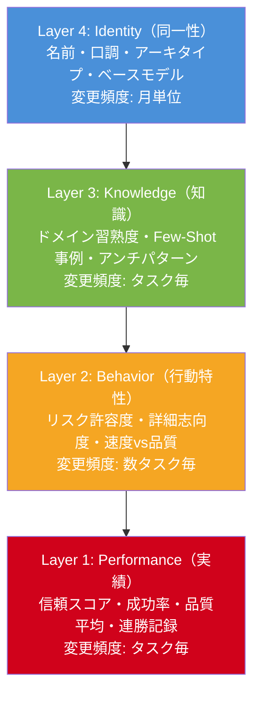
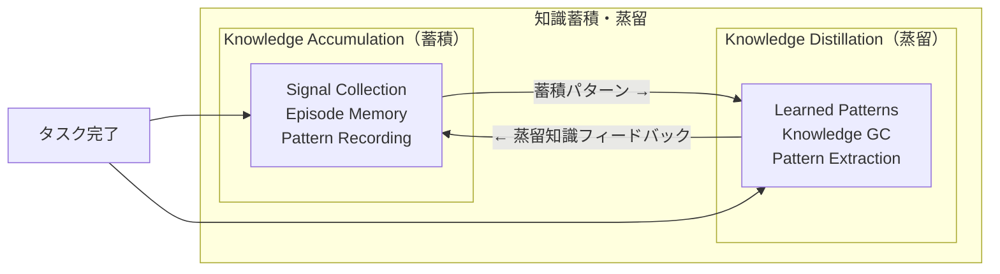

# TANEBI（種火）設計書

---

## 1. 思想・設計ポリシー

### 1.1 コア価値：知識の蓄積と静かな反映

種 火 — 小さな火種から、消えない炎へ。
The spark that never dies — wisdom that grows with every task.

TANEBIは**タスク経験を種火として蓄え、蒸留された知識パターンをシステム全体に静かに反映するマルチエージェント実行フレームワーク**である。
タスクを重ねるたびに蓄積される知識（Learned Patterns）が、次のタスクの品質を静かに押し上げる。

| 問題 | TANEBIの解法 |
|------|-------------|
| エージェントの記憶喪失 | 4層知識モデルで成功パターン・失敗パターン・蒸留知識を永続化 |
| 最適配置の不在 | routing_score に基づく自動マッチング |
| 品質の停滞 | Learning Engine が成功パターンを蒸留し、次タスクに自動注入 |
| 知識のサイロ化 | 共有 Learned Patterns とパターン蒸留でシステム学習 |
| 環境ロックイン | Event Store を介した疎結合で実行環境を自由に選択 |

### 1.2 コアと外部の分離

TANEBIの設計は**コア（Learning Engine + Knowledge Store + フロー決定）と外部（Executor + UI）の分離**を原則とする。

- **Core 層**: Learning Engine、Knowledge Store、フロー決定ロジック。Event Store を介してのみ外部と通信する。Executor の実装を知らない
- **Executor**: `*.requested` イベントを処理し `*.completed` を返す外部実行環境。Task tool / subprocess / Docker 等、自由に差し替え可能

**コアが強いからこそ Executor を自由にできる。**

### 1.3 設計原則

| # | 原則 | 説明 |
|---|------|------|
| P1 | 知識蓄積をコアに、他は交換可能 | 蒸留知識を核に据える |
| P2 | Store抽象化 | EventStore / KnowledgeStore は差し替え可能 |
| P3 | 方向性を早期に絞らない | どの方向にも行ける状態を維持 |
| P4 | 測定に基づく設計判断 | エビデンスベースの設計変更 |
| P5 | タスク経験が知識に変わる | シグナル蓄積→蒸留→サイレント注入のサイクル |

### 1.4 ゼロインフラ原則

```bash
git clone https://github.com/skaji18/tanebi
cd tanebi
claude
# CLAUDE.mdが自動ロード → TANEBIオーケストレーターとして起動
```

Claude Codeさえあれば動く。tmux不要、プロセス管理不要、追加インフラ不要。

---

## 2. アーキテクチャ概要

### 2.1 アーキテクチャ概要図

```
 TANEBI Core                     Event Store                    Executor
 ┌────────────────────┐     ┌─────────────────────┐     ┌────────────────────┐
 │                    │     │  Immutable Event Log │     │                    │
 │  Learning Engine   │     │                     │     │  *.requested を読み │
 │  Knowledge Store   │     │  *.requested →→→→→→→│→→→→→│  処理して           │
 │                    │     │                     │     │  *.completed を返す │
 │  ┌──────────────┐  │     │  *.completed ←←←←←←←│←←←←←│                    │
 │  │ flow決定ロジック│  │     │                     │     │  実装技術は自由:    │
 │  │ (次に何をするか│  │     │  タスク管理:         │     │  LLM / shell /     │
 │  │  を判断)      │  │     │    create_task()    │     │  Docker / Lambda / │
 │  └──────────────┘  │     │    list_tasks()     │     │  何でもよい        │
 │                    │     │    get_task_summary()│     │                    │
 │  ※ Core は        │     │                     │     │  ※ Executor は     │
 │    Executor を     │     │  events/            │     │    Core を知らない  │
 │    知らない        │     │    001_task.created  │     │                    │
 │                    │     │    002_decompose     │     │                    │
 │                    │     │      .requested     │     │                    │
 └────────────────────┘     └─────────────────────┘     └────────────────────┘
```

**設計上の重要な境界**:

- **Core と Executor の分離**: TANEBI Core と Executor は Event Store を介してのみ通信する。
  Core は `*.requested` イベントを発行し、Executor は `*.completed` イベントを返す。
  双方が相手の実装を一切知らない。
- **Event Store は不変ログ + タスク管理**: イベントは事実として蓄積される。キューではなくログ。
  加えて、タスクの作成・一覧・サマリー取得を担う（旧 History Module / new_cmd の役割を吸収）。
- **Executor は自由実装**: イベントスキーマさえ守れば、Executor の実装技術は問わない。

### 2.2 各レイヤーの責務

#### Core 層（カーネル）

変更頻度が最も低く、TANEBI の存在意義そのもの。**ローカルファイルのみ操作し、Executor を一切知らない。**

| コンポーネント | 責務 | 実装 |
|--------------|------|------|
| Event Store | イベントの不変ログ + タスク管理。Core・Executor 間の唯一の通信手段 | ファイルベースイベントログ (`work/{task_id}/events/`) |
| Knowledge Store | 知識データの永続化・管理 | `knowledge/` ディレクトリ |
| Learning Engine | 知識の蓄積・蒸留・反映（Section 6 で詳述） | `scripts/evolve.sh` + `scripts/_fitness.py` |
| フロー決定ロジック | `*.completed` イベントを受けて次の `*.requested` イベントを発行する | 環境依存（LLM / スクリプト等） |

Core の役割は「次に何をするかを決める」こと。実際の実行は Executor に委ねる。

**フロー制御について**: DECOMPOSE→EXECUTE→AGGREGATE→DISTILL のフロー制御は Core 層の責務
（フロー決定ロジック）である。Core が `*.completed` イベントを受けて次の `*.requested` イベントを発行する。

#### Event Store（通信基盤 + タスク管理）

Core と Executor をつなぐ唯一の接点。詳細は Section 3.2 および Section 4。

| 特性 | 説明 |
|------|------|
| 不変性 | イベントは事実として追記される。書き換え・削除しない |
| ログ型 | キューではなくログ。複数の消費者が同じイベントを読める |
| カーソル管理 | 各消費者が自分の処理位置を管理する |
| 冪等性 | イベント ID による重複処理の防止（既存の idempotency_key を活用） |
| タスク管理 | タスクの作成・一覧・サマリー取得を内包（旧 History Module / new_cmd の役割を吸収） |

#### Executor（外部実行環境）

`*.requested` イベントを処理し、`*.completed` イベントを返す。TANEBI Core の外側に位置する。

Executor の唯一の制約は **イベントスキーマを守ること**（Section 4.3）。
LLM で処理しても、シェルスクリプトで処理しても、コンテナで処理しても構わない。
TANEBI はリファレンス実装を同梱するが、それを使う義務はない。

---

## 3. Store抽象化

TANEBI は3つの Store を Protocol として定義する。各 Store はデフォルトでファイル実装を提供し、config.yaml の `storage` セクションで実装を切り替え可能とする。

### 3.1 概要

| Store | 役割 | 操作モデル | デフォルト実装 |
|-------|------|-----------|---------------|
| EventStore | 追記ログ + タスク管理 | 追記・検索・タスクCRUD | ファイルベース (`work/{task_id}/events/`) |
| KnowledgeStore | 知識データ・Learned Patterns の永続化 | KVS・検索・取得 | ファイルベース (`knowledge/`) |

### 3.2 EventStore Protocol

EventStore は以下の3つの責務を持つ:

1. **Core↔Executor間の通信ハブ**（イベント駆動）
2. **イベントの不変ログ**（記録・再現・分析）
3. **タスクindexの内部管理**（emit時に自動更新）

#### メソッド

| メソッド | 説明 |
|---------|------|
| `emit(task_id, event_type, payload)` | イベント発火。連番YAMLファイルとして追記 |
| `create_task(task_id, request)` | タスク初期化。work dir作成 + `task.created` イベント自動発火 |
| `list_tasks()` | タスク一覧取得（旧 History Module の役割を吸収） |
| `get_task_summary(task_id)` | タスクサマリー取得（イベントログから集計） |
| `rebuild_index()` | タスクインデックス再構築 |

#### work dir

work dir（`work/{task_id}/`）は EventStore の**内部実装詳細**である。ユーザーや Core は `task_id` のみ知っていればよい。

ファイル実装:

```
work/{task_id}/
├── events/               # イベントログ
│   ├── 001_task.created.yaml
│   ├── 002_decompose.requested.yaml
│   └── ...
├── request.md            # ユーザー依頼
├── plan.md               # Decomposer出力
├── results/              # Worker出力
│   ├── subtask_001.md
│   └── subtask_002.md
└── report.md             # Aggregator統合レポート
```

#### 起点

`task.created` がタスクの起点イベント。ユーザー入力の受け付け自体は EventStore の外で行われ、`EventStore.create_task()` 呼び出し時に `task.created` が自動発火される。

（旧 `task.create_requested` は廃止。ユーザー入力は EventStore の外の責務。）

### 3.3 KnowledgeStore Protocol

知識データ・Learned Patterns の読み書き・バージョン管理。

| メソッド | 説明 |
|---------|------|
| `copy(persona_id, new_id)` | Portable粒度で複製。Performance は白紙スタート |
| `merge(persona_a, persona_b, weights)` | 2体の role を加重結合し新 role を生成（非破壊） |
| `snapshot(persona_id)` | Full粒度で `personas/history/` に保存 |
| `list()` | アクティブ role 一覧 |
| `restore(snapshot_id, persona_id)` | スナップショットから role を復元 |

ファイル実装:

```
personas/
├── active/               # アクティブPersona
│   ├── generalist_v1.yaml
│   └── backend_specialist_v2.yaml
├── library/              # テンプレート・スナップショット
│   └── seeds/
└── history/              # 自動スナップショット
```

### 3.4 KnowledgeStore ファイル構造

Learned Patterns やエピソード記録を管理する。

ファイル実装:

```
knowledge/
├── learned_patterns/     # 蒸留済み成功パターン
│   ├── backend/
│   ├── frontend/
│   └── testing/
└── episodes/             # エピソード記録
```

### 3.5 実装切り替え

config.yaml の `storage` セクションで各 Store の実装を切り替え可能:

```yaml
storage:
  event_store:
    type: file            # file (default). 将来: redis, s3 等
  knowledge_store:
    type: file            # file (default)
```

---

## 4. イベント駆動アーキテクチャ

### 4.1 設計思想

TANEBI Core と Executor は **Event Store を介してのみ通信** する。

```
Core                        Event Store                      Executor
  │                              │                              │
  │── decompose.requested ──────▶│                              │
  │                              │◀── (Executorが読み取り) ─────│
  │                              │                              │  Decomposer実行
  │                              │◀── task.decomposed ──────────│
  │◀── (Coreが読み取り) ────────│                              │
  │                              │                              │
  │── execute.requested ────────▶│                              │
  │                              │◀── (Executorが読み取り) ─────│
  │                              │                              │  Worker実行
  │                              │◀── worker.completed ─────────│
  │◀── (Coreが読み取り) ────────│                              │
  │                              │                              │
```

- **Core は Executor を知らない**: `*.requested` イベントを発行するだけ。誰がどう処理するかは関知しない
- **Executor は Core を知らない**: `*.requested` イベントを読み、処理し、`*.completed` イベントを返すだけ
- **イベントスキーマが契約**: 名前・ペイロード構造は TANEBI が定義する。双方はこのスキーマだけを知っていればよい
- **transport層は関知しない**: ファイル / Redis / WebSocket 等は Event Store の実装詳細

### 4.2 イベントカタログ（11種）

イベントは以下の11種に整理される。

#### 記録系

| イベント名 | 発火タイミング | ペイロード |
|-----------|--------------|-----------|
| `task.created` | `EventStore.create_task()` 呼び出し時 | `{ task_id, request_summary, timestamp }` |

#### Core → Executor（依頼イベント）

| イベント名 | 発火元 | ペイロード |
|-----------|-------|-----------|
| `decompose.requested` | Core（task.created 後） | `{ task_id, request_path, persona_list, plan_output_path }` |
| `execute.requested` | Core（task.decomposed 後） | `{ task_id, subtask_id, subtask_file, persona_file, output_path, wave }` |
| `aggregate.requested` | Core（全 worker.completed 後） | `{ task_id, results_dir, report_path }` |

#### Executor → Core（完了イベント）

| イベント名 | 発火元 | ペイロード |
|-----------|-------|-----------|
| `task.decomposed` | Executor（Decomposer完了後） | `{ task_id, plan: { subtasks[], waves, persona_assignments[] } }` |
| `worker.started` | Executor（Worker起動時） | `{ task_id, subtask_id, persona_id, wave }` |
| `worker.progress` | Executor（Worker中間出力時） | `{ task_id, subtask_id, message, percent? }` |
| `worker.completed` | Executor（Worker完了時） | `{ task_id, subtask_id, status, quality, domain }` |

#### Core内部

| イベント名 | 発火タイミング | ペイロード |
|-----------|--------------|-----------|
| `wave.completed` | Core（Wave内全Worker完了検知時） | `{ task_id, wave, results_summary }` |
| `task.aggregated` | Executor（Aggregator完了後） | `{ task_id, report_path, quality_summary }` |

#### 例外

| イベント名 | 発火タイミング | ペイロード |
|-----------|--------------|-----------|
| `error.worker_failed` | Worker失敗時 | `{ task_id, subtask_id, error_detail }` |

#### 削除されたイベント

以下のイベントは整理の結果、削除された:

| 削除イベント | 理由 |
|------------|------|
| `task.create_requested` | `task.created` が起点。ユーザー入力受付は EventStore の外 |
| `trust.check` | Trust Module は将来の拡張（Section 11） |
| `cost.token_used` | Cost Module は将来の拡張 |
| `approval.requested` | Approval Module は将来の拡張 |
| `learning.started` | Phase 1 対象外。将来の Module 実装時に追加 |
| `learning.pattern_distilled` | 同上 |
| `learning.pattern_registered` | 同上 |
| `learning.completed` | 同上 |

### 4.3 イベントペイロードスキーマ

```yaml
# events/schema.yaml
events:
  # --- 記録系 ---
  task.created:
    task_id: string
    request_summary: string
    timestamp: string         # ISO8601

  # --- Core → Executor（依頼） ---
  decompose.requested:
    task_id: string
    request_path: string      # work/{task_id}/request.md
    persona_list: string      # カンマ区切りのPersona ID一覧
    plan_output_path: string  # work/{task_id}/plan.md
    timestamp: string

  execute.requested:
    task_id: string
    subtask_id: string
    subtask_file: string      # work/{task_id}/results/subtask_NNN.md の入力定義
    persona_file: string      # personas/active/{id}.yaml
    output_path: string       # work/{task_id}/results/subtask_NNN.md
    wave: integer
    timestamp: string

  aggregate.requested:
    task_id: string
    results_dir: string       # work/{task_id}/results/
    report_path: string       # work/{task_id}/report.md
    timestamp: string

  # --- Executor → Core（完了） ---
  task.decomposed:
    task_id: string
    plan:
      subtasks: array
      waves: integer
      persona_assignments: array

  worker.started:
    task_id: string
    subtask_id: string
    persona_id: string
    wave: integer

  worker.progress:
    task_id: string
    subtask_id: string
    message: string
    percent: number?

  worker.completed:
    task_id: string
    subtask_id: string
    status: enum[success, failure]
    quality: enum[GREEN, YELLOW, RED]
    domain: string

  # --- Core内部 ---
  wave.completed:
    task_id: string
    wave: integer
    results_summary: object

  task.aggregated:
    task_id: string
    report_path: string
    quality_summary: object

  # --- 例外 ---
  error.worker_failed:
    task_id: string
    subtask_id: string
    error_detail: string
```

### 4.4 Event Store 実装

ファイルベースの不変イベントログ + タスク管理として実装する。

#### イベントファイル

```
work/{task_id}/events/
├── 001_task.created.yaml
├── 002_decompose.requested.yaml      # Core → Executor
├── 003_task.decomposed.yaml          # Executor → Core
├── 004_execute.requested.yaml        # Core → Executor
├── 005_worker.started.yaml
├── 006_worker.completed.yaml         # Executor → Core
├── ...
└── 010_task.aggregated.yaml
```

各ファイルのフォーマット:

```yaml
event:
  id: "evt_004"
  type: "execute.requested"
  timestamp: "2026-03-01T12:05:00Z"
  payload:
    task_id: "cmd_001"
    subtask_id: "subtask_001"
    subtask_file: "work/cmd_001/plan_subtasks/subtask_001.md"
    persona_file: "personas/active/backend_specialist_v2.yaml"
    output_path: "work/cmd_001/results/subtask_001.md"
    wave: 1
```

#### タスクインデックス

EventStore はイベント発火時にタスクインデックスを自動更新する:

```yaml
# work/index.yaml（EventStore が自動管理）
tasks:
  - task_id: "cmd_015"
    date: "2026-03-01"
    request_summary: "APIエンドポイント実装"
    total_subtasks: 4
    succeeded: 4
    quality_summary: { GREEN: 3, YELLOW: 1, RED: 0 }
    domains: [backend, testing, docs]
    personas_used: [backend_specialist_v2, test_writer_v1, docs_seed_v1]
    report_path: "work/cmd_015/report.md"
```

#### イベント発火

```bash
# シェルからのイベント発火（リファレンス実装）
bash scripts/emit_event.sh <task_dir> <event_type> '<payload_yaml>'
```

### 4.5 Event Store の特性

#### 不変性

イベントは追記のみ。書き換え・削除しない。連番ファイル名（`001_`, `002_`, ...）が順序を保証する。

#### 消費者カーソル

各消費者（Core / Executor）は自分がどこまで処理したかを管理する。
同じイベントを複数の消費者が読める。

直列実行の場合（LLM の会話フロー、一本通しのスクリプト等）、処理順序が自然に保証されるため
明示的なカーソル管理は不要。将来的に非同期化する場合にカーソルファイルを導入する。

#### 冪等性

イベント ID（`evt_NNN`）による重複処理の防止。既存の idempotency_key を活用する。

---

## 5. Persona 4層モデル

### 5.1 4層構造


```mermaid
graph TD
    L4["Layer 4: Identity（同一性）<br/>名前・口調・アーキタイプ・ベースモデル<br/>変更頻度: 月単位"]
    L3["Layer 3: Knowledge（知識）<br/>ドメイン習熟度・Few-Shot事例・アンチパターン<br/>変更頻度: タスク毎"]
    L2["Layer 2: Behavior（行動特性）<br/>リスク許容度・詳細志向度・速度vs品質<br/>変更頻度: 数タスク毎"]
    L1["Layer 1: Performance（実績）<br/>信頼スコア・成功率・品質平均・連勝記録<br/>変更頻度: タスク毎"]

    L4 --> L3 --> L2 --> L1

    style L4 fill:#4a90d9,color:#fff
    style L3 fill:#7ab648,color:#fff
    style L2 fill:#f5a623,color:#fff
    style L1 fill:#d0021b,color:#fff
```

### 5.2 Persona YAMLスキーマ

```yaml
# personas/active/agent_alpha_v3.yaml
persona:
  id: "agent_alpha_v3"
  base_model: "claude-sonnet-4-6"
  version: 3
  created_at: "2026-03-01T12:00:00"
  parent_version: "agent_alpha_v2"
  lineage: ["agent_alpha_v1", "agent_alpha_v2"]

  # Layer 4: Identity（同一性）
  identity:
    name: "鉄壁のDB職人"
    speech_style: "冷静沈着"
    archetype: specialist     # specialist | generalist | hybrid
    origin: evolved           # seeded | copied | merged | evolved

  # Layer 3: Knowledge（知識）
  knowledge:
    domains:
      - name: database_design
        proficiency: 0.87     # 0.0〜1.0
        task_count: 42
        last_updated: "2026-03-15"
      - name: api_design
        proficiency: 0.65
        task_count: 15
        last_updated: "2026-03-10"
    learned_pattern_refs:
      - "episodic:db:task042_migration_success"
      - "episodic:db:task067_index_optimization"
    anti_patterns:
      - pattern: "N+1クエリの見落とし"
        detected_count: 3
        correction: "JOINまたはeager loadを明示的に検討"

  # Layer 2: Behavior（行動特性）
  behavior:
    risk_tolerance: 0.4       # 0=保守的, 1=積極的
    detail_orientation: 0.85  # 0=概略重視, 1=細部重視
    speed_vs_quality: 0.3     # 0=品質最優先, 1=速度最優先
    autonomy_preference: 0.6
    communication_density: 0.7

  # Layer 1: Performance（実績）
  performance:
    trust_score: 72           # 0-100, Trust Module管理
    total_tasks: 57
    success_rate: 0.89
    avg_quality: GREEN
    specialization_index: 0.75
    streak:
      current: 5
      best: 12
    domain_success_rates:
      database_design: 0.95
      api_design: 0.80
      frontend: 0.45

  # Learning Metadata
  learning:
    generation: 3
    routing_score: 0.82
    last_distill_event:
      type: pattern_reinforcement
      field: detail_orientation
      delta: +0.05
      trigger: "task_089: 詳細レビューで品質向上を確認"
      timestamp: "2026-03-15T14:00:00"
    distill_log:
      - { gen: 1, type: seed, note: "初期シード" }
      - { gen: 2, type: reinforcement, field: "database_design.proficiency", delta: +0.12 }
      - { gen: 3, type: reinforcement, field: "detail_orientation", delta: +0.05 }
    crossover_history: []
```

### 5.3 粒度の定義

| 粒度 | 用途 | 含む層 | サイズ目安 |
|------|------|-------|----------|
| **Full** | 完全バックアップ・移植 | Layer 1-4 全て + Evolution Metadata | ~200行 YAML |
| **Portable** | 他エージェントへのコピー・合成 | Layer 2-4（Performance除外） | ~100行 YAML |
| **Seed** | 新エージェント初期化用 | Layer 4 + Behavior初期値のみ | ~30行 YAML |

Portable粒度がPerformanceを除外する理由: 信頼スコアや成功率は「そのエージェントがその環境で積んだ実績」であり、別のエージェントにコピーすべきでない。

### 5.4 ポータビリティ操作

| 操作 | 説明 |
|------|------|
| **Copy（Clone）** | Portable粒度で複製。Performanceは白紙スタート |
| **Merge** | 2体の人格を加重結合し新しい人格を生成（非破壊操作） |
| **Snapshot** | Full粒度で`personas/history/`に保存。5タスクごとに自動実行 |
| **Restore** | スナップショットからPersonaを復元 |
| **Library** | `personas/library/`にテンプレート/スナップショットを蓄積 |

---

## 6. Learning Engine

### 6.1 知識蓄積アーキテクチャ


```mermaid
graph LR
    subgraph Learning["知識蓄積・蒸留"]
        subgraph KA["Knowledge Accumulation（蓄積）"]
            KA_ops["Signal Collection<br/>Episode Memory<br/>Pattern Recording"]
        end
        subgraph KD["Knowledge Distillation（蒸留）"]
            KD_ops["Learned Patterns<br/>Knowledge GC<br/>Pattern Extraction"]
        end
        KA_ops -- "蓄積パターン →" --> KD_ops
        KD_ops -- "← 蒸留知識フィードバック" --> KA_ops
    end
    TC["タスク完了"] --> KA_ops
    TC --> KD_ops
```

**統合のメカニズム**:

1. **タスク完了時**（毎回）: role YAML更新 + Learned Patterns登録
2. **成功パターン検出時**: 特性のreinforcement + 共有知識に追加
3. **失敗検出時**: 特性のcorrection + anti_pattern追加 + ネガティブ事例登録
4. **月次蒸留イベント**: トップパフォーマーのパターン蒸留 + 世代別GC

### 6.2 routing_score 関数

```yaml
routing_score_function:
  formula: |
    routing_score = w1 * quality_score + w2 * completion_rate + w3 * efficiency + w4 * growth_rate

  weights:
    w1: 0.35    # 品質スコア（GREEN=1.0, YELLOW=0.5, RED=0.0）
    w2: 0.30    # タスク完了率
    w3: 0.20    # 効率（duration_estimate: short=1.0, medium=0.7, long=0.4）
    w4: 0.15    # 成長率（直近タスクの前半後半品質比較）

  window: 20    # 直近20タスクのスライディングウィンドウ
```

実装: `scripts/_fitness.py` の `calculate_fitness()` 関数。`work/cmd_*/results/*.md` のYAML frontmatterからタスク履歴を収集し、スライディングウィンドウで計算する。

### 6.3 Learned Patterns

成功事例を自動蓄積し、Workerに注入する共有知識ベース。

```
knowledge/learned_patterns/
├── backend/
│   ├── task042_migration_success.md
│   └── task067_index_optimization.md
├── testing/
│   └── task055_e2e_pattern.md
└── frontend/
    └── task030_component_design.md
```

- **自動登録条件**: status=success かつ quality=GREEN
- **ドメインあたり上限**: config.yamlで設定（デフォルト100件）
- **Worker注入**: Decomposerがサブタスクのドメインに基づき関連 Learned Patterns を選択し、Workerテンプレートに注入

### 6.4 知識蒸留フロー（distill）

`evolve.sh` が実行する6段階の蒸留ステップ:

| # | ステップ | 対象 | 説明 |
|---|---------|------|------|
| 1 | パフォーマンス更新 | `performance` | `total_tasks`, `success_rate`, `last_task_date` を更新 |
| 2 | 失敗補正 | `knowledge.domains` | 失敗ドメインの `proficiency` を -0.02 調整 |
| 3 | 行動パラメータ調整 | `behavior` | GREEN/RED品質に基づき `risk_tolerance` を微調整 |
| 4 | routing_score 計算 | `learning.routing_score` | `_fitness.py` で計算・更新 |
| 5 | 自動スナップショット | `personas/history/` | `total_tasks` が5の倍数で保存 |
| 6 | Learned Patterns 自動登録 | `knowledge/learned_patterns/` | GREEN+success を登録 |

### 6.5 知識蓄積の速度（目安）

| フェーズ | タスク数 | 期待される変化 |
|---------|---------|-------------|
| 蓄積期 | 0-50 | ドメイン習熟度に差が出始める |
| 特化期 | 50-200 | specialization_index 0.5超のエージェントが出現 |
| 安定期 | 200+ | 各エージェントのニッチが確立。蒸留が主な知識成長源 |

---

## 7. Executor インターフェース

### 7.1 設計思想

TANEBI Core は `*.requested` イベントを発行し、`*.completed` イベントを受け取る。
その間の実行を担うのが **Executor** である。

Core は Executor の実装を一切知らない。Event Store 上のイベントスキーマだけが契約。

| 設計原則 | 説明 |
|---------|------|
| AP-1: Core はイベントだけを知る | `*.requested` を発行し `*.completed` を待つ。実行方式を知らない |
| AP-2: Executor はイベントだけを知る | `*.requested` を読み処理し `*.completed` を返す。Core の内部を知らない |
| AP-3: イベントスキーマが契約 | Section 4.3 で定義されたスキーマが唯一の接点 |
| AP-4: Executor は自由に構成可能 | Task tool / subprocess / Docker / Lambda — 技術選択は Executor の裁量 |
| AP-5: データ交換はYAML契約 | イベントペイロードは全て YAML スキーマで定義 |

### 7.2 Executor の契約

Executor は以下の契約を守る:

1. **`*.requested` イベントを処理する**: Event Store から `decompose.requested`, `execute.requested`, `aggregate.requested` を読み取り、対応する処理を実行する
2. **`*.completed` イベントを返す**: 処理完了後、`task.decomposed`, `worker.completed`, `task.aggregated` 等を Event Store に書き込む
3. **イベントスキーマに従う**: Section 4.3 で定義されたペイロード構造を守る
4. **成果物をファイルとして残す**: plan.md, results/*.md, report.md 等をイベントで指定されたパスに書き出す

これだけが契約。どんな技術で処理するか、何を内部で使うかは Executor の自由。

TANEBI はリファレンス実装を `scripts/` に同梱するが、使用は任意。
環境別の構成例は `docs/adapter-guide.md` を参照。

### 7.3 エラーハンドリング

| イベント | 失敗時の挙動 | リカバリー |
|---------|------------|-----------|
| `decompose.requested` | plan.md 生成されない | ユーザーにエラー報告 |
| `execute.requested` | result YAML `status: failure` | Aggregator が集計。Learning Engine が失敗補正 |
| `aggregate.requested` | report.md 生成されない | ユーザーにエラー報告 |
| イベント発火失敗 | タイムアウト | 非致命的（ログ記録のみ） |

失敗は破棄されない。すべて記録され、Learning Engine のフィードバックループに組み込まれる。

---

## 8. 設定ファイル

### 8.1 config.yaml 完全構造

```yaml
tanebi:
  version: "1.0"

  # === Store設定 ===
  storage:
    event_store:
      type: file              # file (default)
    knowledge_store:
      type: file              # file (default)

  # === パス設定 ===
  paths:
    work_dir: "work"
    persona_dir: "personas/active"
    library_dir: "personas/library"
    history_dir: "personas/history"
    knowledge_dir: "knowledge"
    learned_patterns_dir: "knowledge/learned_patterns"
    episode_dir: "knowledge/episodes"

  # === 実行設定 ===
  execution:
    max_parallel_workers: 5
    worker_max_turns: 30
    default_model: "claude-sonnet-4-6"

  # === Learning Engine 設定 ===
  learning:
    routing_score_weights:
      quality_score: 0.35
      completion_rate: 0.30
      efficiency: 0.20
      growth_rate: 0.15
    routing_score_window: 20
    learned_patterns_max_per_domain: 100
    snapshot_interval: 5
```

---

## 9. ディレクトリ構造

```
tanebi/
├── CLAUDE.md                       # claude-native 用フロー決定ロジック
├── config.yaml                     # 全体設定
│
├── personas/
│   ├── active/                     # アクティブPersona
│   │   ├── generalist_v1.yaml
│   │   └── backend_specialist_v2.yaml
│   ├── library/                    # テンプレート・スナップショット
│   │   └── seeds/
│   │       ├── backend_seed.yaml
│   │       ├── frontend_seed.yaml
│   │       ├── testing_seed.yaml
│   │       ├── docs_seed.yaml
│   │       └── devops_seed.yaml
│   └── history/                    # 自動スナップショット
│
├── knowledge/
│   ├── learned_patterns/           # 蒸留済み成功パターン
│   │   ├── backend/
│   │   ├── frontend/
│   │   └── testing/
│   └── episodes/                   # エピソード記録
│
├── work/                           # タスク作業ディレクトリ（EventStore が管理）
│   ├── cmd_001/
│   │   ├── request.md              # ユーザー依頼
│   │   ├── plan.md                 # Decomposer出力
│   │   ├── results/                # Worker出力
│   │   │   ├── subtask_001.md
│   │   │   └── subtask_002.md
│   │   ├── report.md               # Aggregator統合レポート
│   │   └── events/                 # イベントログ
│   │       ├── 001_task.created.yaml
│   │       └── ...
│   └── index.yaml                  # タスクインデックス（EventStore が自動管理）
│
├── events/
│   └── schema.yaml                 # イベントスキーマ定義（11種）
│
├── templates/                      # Decomposer/Worker/Aggregator テンプレート
│   ├── decomposer.md
│   ├── worker_base.md
│   └── aggregator.md
│
├── scripts/
│   ├── command_executor.sh         # Executor リファレンス実装（subprocess向け）
│   ├── subprocess_worker.sh        # subprocess用 Decomposer/Worker ブリッジ
│   ├── tanebi-callback.sh          # Inbound Callbackスクリプト
│   ├── evolve.sh                   # Learning Engine 実行（Core層）
│   ├── _evolve_helper.py           # 進化ヘルパー
│   ├── _fitness.py                 # 適応度関数
│   ├── persona_ops.sh              # Persona操作（clone/merge）
│   ├── emit_event.sh               # イベント発火（Event Store 書き込み）
│   └── tanebi_config.sh            # パス定数
│
└── docs/
    ├── design.md                   # 本文書
    ├── adapter-guide.md            # アダプター構成ガイド（環境別config.yaml例）
    └── archive/                    # 旧設計文書アーカイブ
```

---

## 10. 削除済み・対象外の機能

| 機能 | 状態 | 備考 |
|------|------|------|
| `lock.py` | 削除済み | TANEBI単体には不要。multi-agent-shogun のセマフォ用途のみであったため除去 |
| `new_cmd.py` / `new_cmd.sh` | `EventStore.create_task()` に吸収 | タスクディレクトリ作成は EventStore の内部実装詳細 |
| `plugins/` ディレクトリ | 削除 | Module/Plugin システムは現時点では実装しない（Section 11 参照） |
| `component_loader.sh` | 削除 | Module/Plugin 不要のため |
| `send_feedback.sh` | `EventStore.emit()` に統合 | フィードバックもイベントとして記録 |
| `estimate_cost.sh` | 対象外 | Cost Module は将来の拡張 |

---

## 11. 将来の拡張展望

Module/Plugin システムは将来の拡張ポイントである。EventStore のイベントを購読する形で後付け可能な設計となっている。現時点では実装しない。

想定される将来の Module:

| Module | 種別 | 役割 |
|--------|------|------|
| Trust | core | 信頼スコアに基づく段階的権限委譲 |
| Progress | ui | Worker実行状況のリアルタイム進捗表示 |
| Approval | ui | 計画承認ゲートと実行中介入ポイント |
| Cost | ui | トークン消費量のトラッキングと表示 |
| Learning | ui | 知識蓄積状況・routing_score 推移の可視化 |

これらの Module は EventStore 上のイベントを購読して動作する。Core の内部実装を知らない。実装する際は、共通の Plugin 基底クラス（`plugin.yaml` + ハンドラ）として設計することで、ユーザによる自由な拡張（Slack通知、GitHub Issue連携等）も同じ仕組みで実現できる。

知識蓄積イベント（`learning.started`, `learning.pattern_distilled`, `learning.pattern_registered`, `learning.completed`）も将来の Module 実装時にイベントカタログに追加する。
