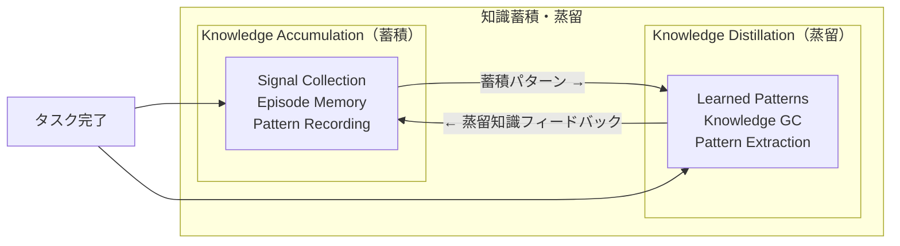

# TANEBI（種火）設計書

---

## 1. 思想・設計ポリシー

### 1.1 コア価値：知識の蓄積と静かな反映

種 火 — 小さな火種から、消えない炎へ。
The spark that never dies — wisdom that grows with every task.

TANEBIは**タスク経験を種火として蓄え、蒸留された知識パターンをシステム全体に静かに反映するマルチエージェント実行フレームワーク**である。
タスクを重ねるたびに蓄積される知識（Learned Patterns）が、次のタスクの品質を静かに押し上げる。

| 問題 | TANEBIの解法 |
|------|-------------|
| エージェントの記憶喪失 | 4層知識モデルで成功パターン・失敗パターン・蒸留知識を永続化 |
| 品質の停滞 | Learning Engine が成功パターンを蒸留し、次タスクに自動注入 |
| 知識のサイロ化 | 共有 Learned Patterns とパターン蒸留でシステム学習 |
| 環境ロックイン | Event Store を介した疎結合で実行環境を自由に選択 |

### 1.2 コアと外部の分離

TANEBIの設計は**コア（Learning Engine + Knowledge Store + フロー決定）と外部（Executor + UI）の分離**を原則とする。

- **Core 層**: Learning Engine、Knowledge Store、フロー決定ロジック。Event Store を介してのみ外部と通信する。Executor の実装を知らない
- **Executor**: `*.requested` イベントを処理し `*.completed` を返す外部実行環境。Task tool / subprocess / Docker 等、自由に差し替え可能

**コアが強いからこそ Executor の実装技術を自由に選択できる。**

### 1.3 設計原則

| # | 原則 | 説明 |
|---|------|------|
| P1 | 知識蓄積をコアに、他は交換可能 | 蒸留知識を核に据える |
| P2 | Store抽象化 | EventStore / KnowledgeStore は差し替え可能 |
| P3 | 方向性を早期に絞らない | どの方向にも行ける状態を維持 |
| P4 | 測定に基づく設計判断 | エビデンスベースの設計変更 |
| P5 | タスク経験が知識に変わる | シグナル蓄積→蒸留→サイレント注入のサイクル |

### 1.4 ゼロインフラ原則

```bash
git clone https://github.com/skaji18/tanebi
cd tanebi
claude
# CLAUDE.mdが自動ロード → TANEBIオーケストレーターとして起動
```

Claude Codeさえあれば動く。tmux不要、プロセス管理不要、追加インフラ不要。

---

## 2. アーキテクチャ概要

### 2.1 アーキテクチャ概要図

```
 TANEBI Core                     Event Store                    Executor
 ┌────────────────────┐     ┌─────────────────────┐     ┌────────────────────┐
 │                    │     │  Immutable Event Log │     │                    │
 │  Learning Engine   │     │                     │     │  *.requested を読み │
 │  Knowledge Store   │     │  *.requested →→→→→→→│→→→→→│  処理して           │
 │                    │     │                     │     │  *.completed を返す │
 │  ┌──────────────┐  │     │  *.completed ←←←←←←←│←←←←←│                    │
 │  │ flow決定ロジック│  │     │                     │     │  実装技術は自由:    │
 │  │ (次に何をするか│  │     │  タスク管理:         │     │  LLM / shell /     │
 │  │  を判断)      │  │     │    create_task()    │     │  Docker / Lambda / │
 │  └──────────────┘  │     │    list_tasks()     │     │  何でもよい        │
 │                    │     │    get_task_summary()│     │                    │
 │  ※ Core は        │     │                     │     │  ※ Executor は     │
 │    Executor を     │     │  events/            │     │    Core を知らない  │
 │    知らない        │     │    001_task.created  │     │                    │
 │                    │     │    002_decompose     │     │                    │
 │                    │     │      .requested     │     │                    │
 └────────────────────┘     └─────────────────────┘     └────────────────────┘
```

**設計上の重要な境界**:

- **Core と Executor の分離**: TANEBI Core と Executor は Event Store を介してのみ通信する。
  Core は `*.requested` イベントを発行し、Executor は `*.completed` イベントを返す。
  双方が相手の実装を一切知らない。
- **Event Store は不変ログ + タスク管理**: イベントは事実として蓄積される。キューではなくログ。
  加えて、タスクの作成・一覧・サマリー取得を担う。
- **Executor は自由実装**: イベントスキーマさえ守れば、Executor の実装技術は問わない。

### 2.2 各レイヤーの責務

#### Core 層（カーネル）

変更頻度が最も低く、TANEBI の存在意義そのもの。**ローカルファイルのみ操作し、Executor を一切知らない。**

| コンポーネント | 責務 | 実装 |
|--------------|------|------|
| Event Store | イベントの不変ログ + タスク管理。Core・Executor 間の唯一の通信手段 | ファイルベースイベントログ (`work/{task_id}/events/`) |
| Knowledge Store | 知識データの永続化・管理 | `knowledge/` ディレクトリ |
| Learning Engine | 知識の蓄積・蒸留・反映（Section 5 で詳述） | `tanebi.core.signal` + `tanebi.core.distill` + `tanebi.core.inject` |
| フロー決定ロジック | `*.completed` イベントを受けて次の `*.requested` イベントを発行する | 環境依存（LLM / スクリプト等） |

Core の役割は「次に何をするかを決める」こと。実際の実行は Executor に委ねる。

**フロー制御について**: DECOMPOSE→EXECUTE→[CHECKPOINT]→AGGREGATE→LEARN のフロー制御は Core 層の責務（フロー決定ロジック）である。LEARN は signal → distill → inject の3ステップからなる。Core が `*.completed` イベントを受けて次の `*.requested` イベントを発行する。

#### Event Store（通信基盤 + タスク管理）

Core と Executor をつなぐ唯一の接点。詳細は Section 3.2 および Section 4。

| 特性 | 説明 |
|------|------|
| 不変性 | イベントは事実として追記される。書き換え・削除しない |
| ログ型 | キューではなくログ。複数の消費者が同じイベントを読める |
| カーソル管理 | 各消費者が自分の処理位置を管理する |
| 冪等性 | イベント ID による重複処理の防止（既存の idempotency_key を活用） |
| タスク管理 | タスクの作成・一覧・サマリー取得を内包 |

#### Executor（外部実行環境）

`*.requested` イベントを処理し、`*.completed` イベントを返す。TANEBI Core の外側に位置する。

Executor の唯一の制約は **イベントスキーマを守ること**（Section 4.3）。
LLM で処理しても、シェルスクリプトで処理しても、コンテナで処理しても構わない。
TANEBI はリファレンス実装を同梱するが、それを使う義務はない。

---

## 3. Store抽象化

TANEBI は2つの Store を Protocol として定義する。各 Store はデフォルトでファイル実装を提供し、config.yaml の `storage` セクションで実装を切り替え可能とする。

### 3.1 概要

| Store | 役割 | 操作モデル | デフォルト実装 |
|-------|------|-----------|---------------|
| `EventStore` | 追記ログ + タスク管理 | 追記・検索・タスクCRUD | ファイルベース (`work/{task_id}/events/`) |
| `KnowledgeStore` | 知識データ・Learned Patterns の永続化 | KVS・検索・取得 | ファイルベース (`knowledge/`) |

### 3.2 `EventStore` Protocol

`EventStore` は以下の3つの責務を持つ:

1. **Core↔Executor間の通信ハブ**（イベント駆動）
2. **イベントの不変ログ**（記録・再現・分析）
3. **タスクindexの内部管理**（emit時に自動更新）

#### メソッド（実装: `src/tanebi/event_store/__init__.py`）

| メソッド | 説明 | 実装状態 |
|---------|------|---------|
| `emit_event(cmd_dir, event_type, payload)` | イベント発火。連番YAMLファイルとして追記 | 実装済み |
| `create_task(work_dir, task_id, request)` | タスク初期化。work dir作成 + `task.created` イベント自動発火 | 実装済み |
| `list_events(cmd_dir)` | タスクのイベントログを連番昇順で取得 | 実装済み |
| `get_task_summary(cmd_dir)` | タスクサマリー取得（イベントログから集計） | 実装済み |
| `list_tasks()` | タスク一覧取得 | **未実装（将来予定）** |
| `rebuild_index()` | タスクインデックス再構築 | **未実装（将来予定）** |

#### work dir

work dir（`work/{task_id}/`）は `EventStore` の**内部実装詳細**である。ユーザーや Core は `task_id` のみ知っていればよい。

ファイル実装:

```
work/{task_id}/
├── events/               # イベントログ
│   ├── 001_task.created.yaml
│   ├── 002_decompose.requested.yaml
│   └── ...
├── request.md            # ユーザー依頼
├── plan.round{N}.md      # Decomposer出力（ラウンド番号付き）
├── results/              # Worker出力
│   └── round{N}/         # ラウンド別サブディレクトリ
│       ├── subtask_001.md
│       └── subtask_002.md
└── report.md             # Aggregator統合レポート
```

#### 起点

`task.created` がタスクの起点イベント。ユーザー入力の受け付け自体は EventStore の外で行われ、`EventStore.create_task()` 呼び出し時に `task.created` が自動発火される。

（旧 `task.create_requested` は廃止。ユーザー入力は `EventStore` の外の責務。）

### 3.3 `KnowledgeStore` Protocol

知識データ・Learned Patterns の読み書き・バージョン管理。

| メソッド | 説明 |
|---------|------|
| `get_patterns(domain)` | 指定ドメインの Learned Patterns を取得 |
| `save_signal(domain, signal)` | シグナルを `knowledge/signals/{domain}/` に書き出す |
| `save_pattern(domain, pattern)` | 蒸留済みパターンを `knowledge/learned/{domain}/` に書き出す |
| `list_domains()` | 既知ドメイン一覧 |

ファイル実装:

```
knowledge/
├── signals/              # シグナル蓄積（生データ）
│   ├── coding/
│   └── testing/
├── learned/              # 蒸留済みパターン
│   ├── coding/
│   └── testing/
└── _meta/                # メタデータ
    └── distill_log.yaml
```

### 3.4 `KnowledgeStore` ファイル構造

ファイル構造は Section 3.3 参照。

### 3.5 実装切り替え

config.yaml の `storage` セクションで各 Store の実装を切り替え可能:

```yaml
storage:
  event_store:
    type: file            # file (default). 将来: redis, s3 等
  knowledge_store:
    type: file            # file (default)
```

※ storage セクションは将来実装予定。現在は file ベース固定。

---

## 4. イベント駆動アーキテクチャ

### 4.1 設計思想

TANEBI Core と Executor は **Event Store を介してのみ通信** する。

```
Core                        Event Store                      Executor
  │                              │                              │
  │── decompose.requested ──────▶│                              │
  │                              │◀── (Executorが読み取り) ─────│
  │                              │                              │  Decomposer実行
  │                              │◀── task.decomposed ──────────│
  │◀── (Coreが読み取り) ────────│                              │
  │                              │                              │
  │── execute.requested ────────▶│                              │
  │                              │◀── (Executorが読み取り) ─────│
  │                              │                              │  Worker実行
  │                              │◀── worker.completed ─────────│
  │◀── (Coreが読み取り) ────────│                              │
  │                              │                              │
```

- **Core は Executor を知らない**: `*.requested` イベントを発行するだけ。誰がどう処理するかは関知しない
- **Executor は Core を知らない**: `*.requested` イベントを読み、処理し、`*.completed` イベントを返すだけ
- **イベントスキーマが契約**: 名前・ペイロード構造は TANEBI が定義する。双方はこのスキーマだけを知っていればよい
- **transport層は関知しない**: ファイル / Redis / WebSocket 等は Event Store の実装詳細
- **タイムスタンプはイベントファイルのメタデータ（ファイル名の連番）で管理される**

### 4.2 イベントカタログ（15種）

イベントは以下の15種に整理される。

#### 記録系

| イベント名 | 発火タイミング | ペイロード |
|-----------|--------------|-----------|
| `task.created` | `EventStore.create_task()` 呼び出し時 | `{ task_id, request_summary, timestamp }` |

#### Core → Executor（依頼イベント）

| イベント名 | 発火元 | ペイロード |
|-----------|-------|-----------|
| `decompose.requested` | Core（task.created 後） | `{ task_id, request_path, plan_output_path, round, checkpoint_feedback? }` |
| `execute.requested` | Core（task.decomposed 後） | `{ task_id, subtask_id, subtask_description, wave, round, output_path }` |
| `aggregate.requested` | Core（全 worker.completed 後） | `{ task_id, results_dir, report_path, round }` |

#### Executor → Core（完了イベント）

| イベント名 | 発火元 | ペイロード |
|-----------|-------|-----------|
| `task.decomposed` | Executor（Decomposer完了後） | `{ task_id, plan_path, round }` |
| `worker.started` | Executor（Worker起動時） | `{ task_id, subtask_id, wave, round }` |
| `worker.progress` | Executor（Worker中間出力時） | `{ task_id, subtask_id, message, percent? }` |
| `worker.completed` | Executor（Worker完了時） | `{ task_id, subtask_id, status, quality, domain, wave, round }` |
| `task.aggregated` | Executor（Aggregator完了後） | `{ task_id, report_path, quality_summary }` |

#### Core内部

| イベント名 | 発火タイミング | ペイロード |
|-----------|--------------|-----------|
| `wave.completed` | Core（Wave内全Worker完了検知時） | `{ task_id, wave, round, results_summary }` |

#### Checkpoint（checkpoint-design.md より）

| イベント名 | 発火元 | ペイロード |
|-----------|-------|-----------|
| `checkpoint.requested` | Core（最終通常wave完了後） | `{ task_id, subtask_id, subtask_type, round, wave, request_path, plan_path, results_dir, output_path }` |
| `checkpoint.completed` | Core（verdict集約後） | `{ task_id, round, verdict, failed_subtasks, summary }` |

#### Learning Engine（learning-engine.md 付録 B より）

| イベント名 | 発火元 | ペイロード |
|-----------|-------|-----------|
| `distill.requested` | Core（N≥K 検知時） | `{ task_id, domain, signal_count, signal_ids }` |
| `distill.completed` | Executor | `{ task_id, domain, patterns_created, confidence }` |

#### 例外

| イベント名 | 発火タイミング | ペイロード |
|-----------|--------------|-----------|
| `error.worker_failed` | Worker失敗時 | `{ task_id, subtask_id, error_detail }` |

#### 削除されたイベント

以下のイベントは整理の結果、削除された:

| 削除イベント | 理由 |
|------------|------|
| `task.create_requested` | `task.created` が起点。ユーザー入力受付は EventStore の外 |
| `trust.check` | Trust Module は将来の拡張（Section 10） |
| `cost.token_used` | Cost Module は将来の拡張 |
| `approval.requested` | Approval Module は将来の拡張 |
| `learning.started` | Phase 1 対象外。将来の Module 実装時に追加 |
| `learning.pattern_distilled` | 同上 |
| `learning.pattern_registered` | 同上 |
| `learning.completed` | 同上 |

### 4.3 イベントペイロードスキーマ

```yaml
# events/schema.yaml
events:
  # --- 記録系 ---
  task.created:
    task_id: string
    request_summary: string

  # --- Core → Executor（依頼） ---
  decompose.requested:
    task_id: string
    request_path: string      # work/{task_id}/request.md
    plan_output_path: string  # work/{task_id}/plan.round{N}.md
    round: integer            # ラウンド番号（初回=1, re-decompose=2+）
    checkpoint_feedback: "object?"  # re-decompose 時のみ（前ラウンドの失敗情報）

  execute.requested:
    task_id: string
    subtask_id: string
    subtask_description: string  # サブタスクの説明
    wave: integer
    round: integer              # ラウンド番号
    output_path: string         # Worker の出力先パス（results/round{N}/{subtask_id}.md）

  aggregate.requested:
    task_id: string
    results_dir: string       # work/{task_id}/results/round{N}/
    report_path: string       # work/{task_id}/report.md
    round: integer            # ラウンド番号

  # --- Executor → Core（完了） ---
  task.decomposed:
    task_id: string
    plan_path: string         # plan.round{N}.md のパス
    round: integer            # ラウンド番号

  worker.started:
    task_id: string
    subtask_id: string
    wave: integer
    round: integer            # ラウンド番号

  worker.progress:
    task_id: string
    subtask_id: string
    message: string
    percent: number?

  worker.completed:
    task_id: string
    subtask_id: string
    status: enum[success, failure]
    quality: enum[GREEN, YELLOW, RED]
    domain: string
    wave: integer
    round: integer

  # --- Core内部 ---
  wave.completed:
    task_id: string
    wave: integer
    round: integer
    results_summary: object

  task.aggregated:
    task_id: string
    report_path: string
    quality_summary: object

  # --- 例外 ---
  error.worker_failed:
    task_id: string
    subtask_id: string
    error_detail: string

  # --- Checkpoint ---
  checkpoint.requested:
    task_id: string
    subtask_id: string        # checkpoint subtask の ID
    subtask_type: checkpoint  # ExecutorListener が分岐するためのフラグ
    round: integer
    wave: integer
    request_path: string      # request.md のパス
    plan_path: string         # plan.round{N}.md のパス
    results_dir: string       # results/round{N}/ のパス
    output_path: string       # checkpoint 結果の出力先

  checkpoint.completed:
    task_id: string
    round: integer
    verdict: "enum[pass, fail]"
    failed_subtasks: array    # attribution 情報を含む
    summary: string

  # --- Learning Engine ---
  # distill.requested / distill.completed のスキーマは docs/learning-engine.md 付録 B を参照
```

### 4.4 Event Store 実装

ファイルベースの不変イベントログ + タスク管理として実装する。

#### イベントファイル

```
work/{task_id}/events/
├── 001_task.created.yaml
├── 002_decompose.requested.yaml      # Core → Executor
├── 003_task.decomposed.yaml          # Executor → Core
├── 004_execute.requested.yaml        # Core → Executor
├── 005_worker.started.yaml
├── 006_worker.completed.yaml         # Executor → Core
├── ...
└── 010_task.aggregated.yaml
```

各ファイルのフォーマット:

```yaml
event:
  id: "evt_004"
  type: "execute.requested"
  timestamp: "2026-03-01T12:05:00Z"
  payload:
    task_id: "cmd_001"
    subtask_id: "subtask_001"
    subtask_description: "FizzBuzz の実装。Python。テストファースト。"
    wave: 1
```

#### タスクインデックス

**（注: `work/index.yaml` 自動管理は将来実装予定。現在は `list_events(cmd_dir)` で各タスクのイベントを直接参照し、`get_task_summary(cmd_dir)` でサマリーを取得する。）**

将来の設計（現在未実装）:

```yaml
# work/index.yaml（EventStore が自動管理、将来実装予定）
tasks:
  - task_id: "cmd_015"
    date: "2026-03-01"
    request_summary: "APIエンドポイント実装"
    total_subtasks: 4
    succeeded: 4
    quality_summary: { GREEN: 3, YELLOW: 1, RED: 0 }
    domains: [backend, testing, docs]
    report_path: "work/cmd_015/report.md"
```

#### イベント発火

```bash
# CLI からのイベント発火
tanebi emit <task_id> <event_type> [key=value ...]
```

### 4.5 Event Store の特性

#### 不変性

イベントは追記のみ。書き換え・削除しない。連番ファイル名（`001_`, `002_`, ...）が順序を保証する。

#### 消費者カーソル

各消費者（Core / Executor）は自分がどこまで処理したかを管理する。
同じイベントを複数の消費者が読める。

直列実行の場合（LLM の会話フロー、一本通しのスクリプト等）、処理順序が自然に保証されるため
明示的なカーソル管理は不要。将来的に非同期化する場合にカーソルファイルを導入する。

#### 冪等性

イベント ID（`evt_NNN`）による重複処理の防止。既存の idempotency_key を活用する。

---

## 5. Learning Engine

### 5.1 知識蓄積アーキテクチャ


```mermaid
graph LR
    subgraph Learning["知識蓄積・蒸留"]
        subgraph KA["Knowledge Accumulation（蓄積）"]
            KA_ops["Signal Collection<br/>Episode Memory<br/>Pattern Recording"]
        end
        subgraph KD["Knowledge Distillation（蒸留）"]
            KD_ops["Learned Patterns<br/>Knowledge GC<br/>Pattern Extraction"]
        end
        KA_ops -- "蓄積パターン →" --> KD_ops
        KD_ops -- "← 蒸留知識フィードバック" --> KA_ops
    end
    TC["タスク完了"] --> KA_ops
    TC --> KD_ops
```

**統合のメカニズム**（signal → distill → inject の 3 フェーズ）:

1. **Signal Detection**（タスク完了ごと）: `worker.completed` から quality/domain 等のシグナルを抽出し `knowledge/signals/` に蓄積
2. **Pattern Distillation**（N≥K 条件成立時）: 同一ドメインのシグナルが閾値を超えたら LLM で汎化パターンを抽出し `knowledge/learned/` に保存
3. **Silent Injection**（Worker 起動時）: 該当ドメインの Learned Patterns を Worker プロンプトに自動注入（`inject.py`）

### 5.2 Learned Patterns

成功・失敗パターンを自動蓄積し、Worker に注入する共有知識ベース。

```
knowledge/learned/
├── backend/
│   ├── approach_001.yaml
│   └── avoid_001.yaml
├── testing/
│   └── approach_001.yaml
└── api_design/
    └── decompose_001.yaml
```

- **蒸留条件**: 同一ドメインのシグナル N≥K（デフォルト K=5）
- **パターン種別**: approach / avoid / decompose / tooling
- **Worker注入**: `inject.py` が execute.requested 時に該当ドメインのパターンを選択し、Worker プロンプトに追加

### 5.3 知識蒸留フロー（distill）

`distill.py` が実行する蒸留ステップ:

| # | ステップ | 処理 |
|---|---------|------|
| 1 | Signal Accumulation | `worker.completed` → `knowledge/signals/{domain}/signal_*.yaml` に書き出し |
| 2 | Distillation Trigger | 同一ドメインのシグナル数 N ≥ K を検知 |
| 3 | Pattern Extraction | LLM ベースで汎化パターンを抽出（具体情報を除去） |
| 4 | Pattern Storage | `knowledge/learned/{domain}/{type}_*.yaml` に書き出し |

---

## 6. Executor インターフェース

### 6.1 設計思想

TANEBI Core は `*.requested` イベントを発行し、`*.completed` イベントを受け取る。
その間の実行を担うのが **Executor** である。

Core は Executor の実装を一切知らない。Event Store 上のイベントスキーマだけが契約。

| 設計原則 | 説明 |
|---------|------|
| AP-1: Core はイベントだけを知る | `*.requested` を発行し `*.completed` を待つ。実行方式を知らない |
| AP-2: Executor はイベントだけを知る | `*.requested` を読み処理し `*.completed` を返す。Core の内部を知らない |
| AP-3: イベントスキーマが契約 | Section 4.3 で定義されたスキーマが唯一の接点 |
| AP-4: Executor は自由に構成可能 | Task tool / subprocess / Docker / Lambda — 技術選択は Executor の裁量 |
| AP-5: データ交換はYAML契約 | イベントペイロードは全て YAML スキーマで定義 |

### 6.2 Executor の契約

Executor は以下の契約を守る:

1. **`*.requested` イベントを処理する**: Event Store から `decompose.requested`, `execute.requested`, `aggregate.requested` を読み取り、対応する処理を実行する
2. **`*.completed` イベントを返す**: 処理完了後、`task.decomposed`, `worker.completed`, `task.aggregated` 等を Event Store に書き込む
3. **イベントスキーマに従う**: Section 4.3 で定義されたペイロード構造を守る
4. **成果物をファイルとして残す**: plan.md, results/*.md, report.md 等をイベントで指定されたパスに書き出す

これだけが契約。どんな技術で処理するか、何を内部で使うかは Executor の自由。

TANEBI はリファレンス実装を `scripts/` に同梱するが、使用は任意。

### 6.3 エラーハンドリング

| イベント | 失敗時の挙動 | リカバリー |
|---------|------------|-----------|
| `decompose.requested` | plan.md 生成されない | ユーザーにエラー報告 |
| `execute.requested` | result YAML `status: failure` | Aggregator が集計。Learning Engine が失敗補正 |
| `aggregate.requested` | report.md 生成されない | ユーザーにエラー報告 |
| イベント発火失敗 | タイムアウト | 非致命的（ログ記録のみ） |

失敗は破棄されない。すべて記録され、Learning Engine のフィードバックループに組み込まれる。

---

## 7. 設定ファイル

### 7.1 config.yaml 完全構造

```yaml
tanebi:
  version: "1.0"

  # === Store設定 ===
  storage:
    event_store:
      type: file              # file (default)
    knowledge_store:
      type: file              # file (default)

  # === パス設定 ===
  paths:
    work_dir: "work"
    knowledge_dir: "knowledge"
    signals_dir: "knowledge/signals"
    learned_dir: "knowledge/learned"

  # === 実行設定 ===
  execution:
    max_parallel_workers: 5
    worker_max_turns: 30
    default_model: "claude-sonnet-4-6"

  # === Checkpoint 設定 ===
  checkpoint:
    mode: auto          # always | auto | never
    max_rounds: 3       # 最大ループ回数
    verdict_policy: any_fail   # any_fail | majority | all_fail

  # === Learning Engine 設定 ===
  learning:
    signal:
      auto_detect: true
      retention_days: 90
    distillation:
      min_signals: 5
      min_confidence: 0.6
      auto_trigger: true
    injection:
      max_approach: 5
      max_avoid: 3
      max_decompose: 2
      max_tooling: 2
```

---

## 8. ディレクトリ構造

```
tanebi/
├── CLAUDE.md                       # claude-native 用フロー決定ロジック
├── config.yaml                     # 全体設定
│
├── knowledge/
│   ├── signals/                    # シグナル蓄積（生データ）
│   │   ├── coding/
│   │   ├── testing/
│   │   └── api_design/
│   ├── learned/                    # 蒸留済みパターン
│   │   ├── coding/
│   │   ├── testing/
│   │   └── api_design/
│   └── _meta/                      # メタデータ
│       └── distill_log.yaml
│
├── work/                           # タスク作業ディレクトリ（EventStore が管理）
│   ├── cmd_001/
│   │   ├── request.md              # ユーザー依頼
│   │   ├── plan.round{N}.md        # Decomposer出力（ラウンド番号付き）
│   │   ├── results/                # Worker出力
│   │   │   └── round{N}/           # ラウンド別サブディレクトリ
│   │   │       ├── subtask_001.md
│   │   │       └── subtask_002.md
│   │   ├── report.md               # Aggregator統合レポート
│   │   └── events/                 # イベントログ
│   │       ├── 001_task.created.yaml
│   │       └── ...
│   └── index.yaml                  # タスクインデックス（EventStore が自動管理、将来実装予定）
│
├── events/
│   └── schema.yaml                 # イベントスキーマ定義
│
├── templates/                      # Decomposer/Worker/Aggregator テンプレート
│   ├── decomposer.md
│   ├── worker_base.md
│   ├── checkpoint.md
│   └── aggregator.md
│
├── scripts/
│   └── setup.sh                    # セットアップスクリプト（venv 作成・依存インストール）
│   # ※ Executor リファレンス実装は src/tanebi/executor/ に Python で実装
│   # ※ イベント発火は tanebi.event_store.emit_event() (Python API)
│
└── docs/
    ├── design.md                   # 本文書
    ├── getting-started.md          # 入門ガイド
    ├── executor-design.md          # Executor 設計詳細
    ├── listener-flow.md            # Listener フロー
    ├── native-flow.md              # Native フロー
    ├── checkpoint-design.md        # Checkpoint 設計
    ├── learning-engine.md          # Learning Engine 詳細
    └── mutation-design.md          # Mutation 設計
```

---

## 9. 削除済み・対象外の機能

| 機能 | 状態 | 備考 |
|------|------|------|
| `lock.py` | 削除済み | TANEBI単体には不要。multi-agent-shogun のセマフォ用途のみであったため除去 |
| `new_cmd.py` / `new_cmd.sh` | `EventStore.create_task()` に吸収 | タスクディレクトリ作成は EventStore の内部実装詳細 |
| `plugins/` ディレクトリ | 削除 | Module/Plugin システムは現時点では実装しない（Section 10 参照） |
| `component_loader.sh` | 削除 | Module/Plugin 不要のため |
| `send_feedback.sh` | `EventStore.emit()` に統合 | フィードバックもイベントとして記録 |
| `estimate_cost.sh` | 対象外 | Cost Module は将来の拡張 |

---

## 10. 将来の拡張展望

Module/Plugin システムは将来の拡張ポイントである。EventStore のイベントを購読する形で後付け可能な設計となっている。現時点では実装しない。

想定される将来の Module:

| Module | 種別 | 役割 |
|--------|------|------|
| Trust | core | 信頼スコアに基づく段階的権限委譲 |
| Progress | ui | Worker実行状況のリアルタイム進捗表示 |
| Approval | ui | 計画承認ゲートと実行中介入ポイント |
| Cost | ui | トークン消費量のトラッキングと表示 |
| Learning | ui | 知識蓄積状況の可視化 |

これらの Module は EventStore 上のイベントを購読して動作する。Core の内部実装を知らない。実装する際は、共通の Plugin 基底クラス（`plugin.yaml` + ハンドラ）として設計することで、ユーザによる自由な拡張（Slack通知、GitHub Issue連携等）も同じ仕組みで実現できる。

知識蓄積イベント（`learning.started`, `learning.pattern_distilled`, `learning.pattern_registered`, `learning.completed`）も将来の Module 実装時にイベントカタログに追加する。
