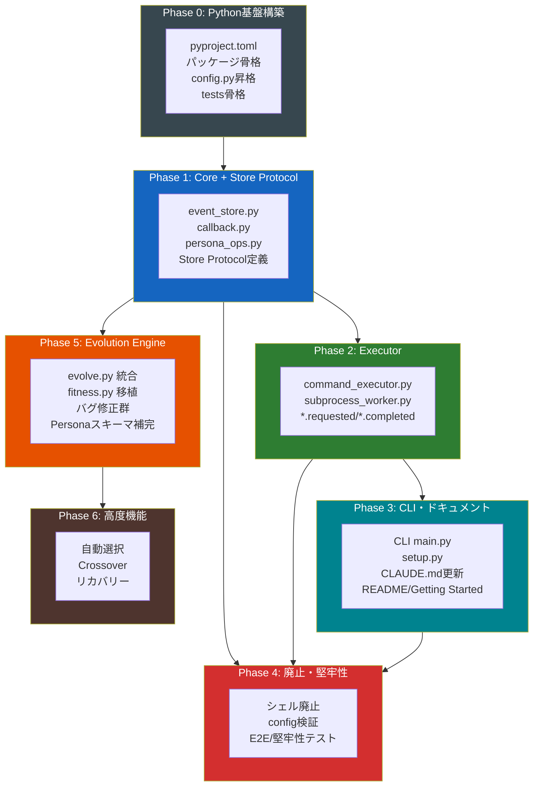

# TANEBI 実装ロードマップ（Python化対応版）

生成日: 2026-02-22
改訂者: 軍師 (subtask_049a)
前版: subtask_045b（Python化対応初版）
根拠資料:
- `docs/design.md` — 設計書 (ground truth, subtask_049aで改訂済み)
- `ashigaru1_report_045a.yaml` — 全14シェルスクリプトPython化棚卸し
- `ashigaru1_report_044a.yaml` / `ashigaru2_report_044b.yaml` — コンポーネント棚卸し
- `reports/cmd_040_integrated_analysis.md` — 品質課題統合レポート (C7件 / M16件 / m8件)

---

## 0. 方針転換の背景

### 殿の方針

> 「スクリプト類は全てPythonで作り直し。シェルで頑張っても仕方ない」

### 転換の理由

現行TANEBIは14本のシェルスクリプトで構成されている。以下の制約が開発速度と品質のボトルネックになっている:

| シェルの制約 | 具体的な問題 | Python化による解消 |
|-------------|------------|------------------|
| YAML操作の困難さ | `grep` + `sed` + inline Python でパース。破損リスク (M-015) | `PyYAML` / `ruamel.yaml` で安全な読み書き |
| エラーハンドリングの弱さ | Worker全失敗がサイレントサクセス (M-001) | 例外機構 + 型付きリターン |
| テスタビリティの低さ | batsテストのみ。モック困難 | pytest + モック + カバレッジ |
| セキュリティの脆弱性 | シェルインジェクション (C-001) | `subprocess.run(shell=False)` で根絶 |
| コード重複 | `_read_payload()` が4プラグインで重複実装 | 共通モジュールで一元化 |
| macOS/Linux差異 | `stat -f` vs `stat -c`、`sed -i ''` vs `sed -i` | `os` / `pathlib` で吸収 |

### 本ロードマップの方針

**シェルスクリプトの修正・拡張は行わない。Pythonで作り直す。**

移行戦略は「**モジュール単位一括置換**」を採用する:
- 依存グラフの下流（基盤モジュール）から順にPython化
- 各モジュール完成後、対応するシェルスクリプトを即座に廃止（シェルラッパーによる互換維持は行わない）
- 殿の「作り直し」の意図に沿い、旧コードの延命はしない

**理由**: 段階置換（シェルラッパー維持）は二重メンテのコストが高く、中途半端な状態が長期化する。TANEBIは開発チーム内ツールであり、外部ユーザーへの後方互換は不要。

### 設計判断: Module/Plugin システム

design.md (subtask_049a) の設計判断により、Module/Plugin システムは Phase 1 の実装対象外とした。
EventStore のイベント購読で後付け可能な設計を維持しつつ、現時点では実装しない。
これにより、Plugin システム全体（component_loader, handler.sh, plugin.yaml 規約, preset）がロードマップから削除された。

History Module の機能は `EventStore.list_tasks()` / `EventStore.get_task_summary()` に吸収。
`new_cmd.sh` / `new_cmd.py` は `EventStore.create_task()` に吸収。

---

## 1. Pythonプロジェクト基盤設計

### 1.1 パッケージ構造

```
tanebi/                          # プロジェクトルート（既存）
├── pyproject.toml               # NEW: パッケージ定義・依存管理
├── src/
│   └── tanebi/                  # NEW: メインパッケージ
│       ├── __init__.py
│       ├── core/                # コアモジュール群
│       │   ├── __init__.py
│       │   ├── config.py        # ← scripts/tanebi_config.py 昇格
│       │   ├── event_store.py   # ← emit_event.sh + send_feedback.sh + new_cmd.sh 統合
│       │   ├── callback.py      # ← tanebi-callback.sh
│       │   └── persona_ops.py   # ← persona_ops.sh
│       ├── executor/            # 実行環境モジュール群
│       │   ├── __init__.py
│       │   ├── command_executor.py  # ← command_executor.sh
│       │   └── subprocess_worker.py # ← subprocess_worker.sh
│       └── cli/                 # CLIモジュール群
│           ├── __init__.py
│           ├── main.py          # ← scripts/tanebi (エントリポイント)
│           └── setup.py         # ← setup.sh
├── tests/                       # NEW: pytest テストスイート
│   ├── conftest.py
│   ├── unit/
│   │   ├── test_event_store.py
│   │   ├── test_config.py
│   │   ├── test_persona_ops.py
│   │   ├── test_callback.py
│   │   └── test_command_executor.py
│   └── integration/
│       └── test_e2e_flow.py
├── scripts/                     # 過渡期: 移行完了後に廃止
│   ├── _evolve_helper.py        # → Phase 5 で tanebi.core.evolve に吸収
│   ├── _fitness.py              # → Phase 5 で tanebi.core.fitness に吸収
│   └── tanebi_config.py         # → tanebi.core.config に吸収
├── config.yaml
├── docs/
├── personas/
├── templates/
├── knowledge/
└── work/
```

### 1.2 依存管理

`pyproject.toml` を採用する（`requirements.txt` は廃止）。

```toml
[project]
name = "tanebi"
version = "0.1.0"
requires-python = ">=3.10"
dependencies = [
    "pyyaml>=6.0",
]

[project.optional-dependencies]
dev = [
    "pytest>=8.0",
    "pytest-cov>=5.0",
]

[project.scripts]
tanebi = "tanebi.cli.main:main"

[build-system]
requires = ["setuptools>=68.0"]
build-backend = "setuptools.backends._legacy:_Backend"

[tool.setuptools.packages.find]
where = ["src"]
```

### 1.3 CLIエントリポイント

`tanebi` コマンドは `pyproject.toml` の `[project.scripts]` で定義する。
`pip install -e .` 後に `tanebi` コマンドとして利用可能になる。

サブコマンド構造（`argparse` 使用。Click は外部依存を増やすため不採用）:

```
tanebi <prompt>          # タスク実行（デフォルト）
tanebi new               # 新規タスク作成（EventStore.create_task 呼び出し）
tanebi persona list      # ペルソナ一覧
tanebi persona copy      # ペルソナコピー
tanebi persona merge     # ペルソナマージ
tanebi status            # 現在のステータス
tanebi config            # 設定表示
tanebi setup             # 初期セットアップ
```

### 1.4 既存Pythonファイルとの統合方針

| 既存ファイル | 統合先 | 方針 |
|------------|--------|------|
| `scripts/tanebi_config.py` | `src/tanebi/core/config.py` | そのまま昇格。`TANEBI_ROOT` 解決 + config.yaml 読み取りの基盤 |
| `scripts/_fitness.py` | `src/tanebi/core/fitness.py` | Phase 5（Post-MVP）でロジックを移植 |
| `scripts/_evolve_helper.py` | `src/tanebi/core/evolve.py` | Phase 5（Post-MVP）で `evolve.sh` のロジックを統合 |

### 1.5 テスト戦略

| 項目 | 方針 |
|------|------|
| フレームワーク | `pytest` |
| カバレッジ目標 | core/ は 80% 以上 |
| 既存 bats テスト | 廃止（Python移行完了後に削除） |
| CI | 未定（ローカル `pytest` 実行を基本とする） |
| テストデータ | `tests/fixtures/` に config.yaml / persona YAML / event YAML のサンプルを配置 |

---

## 2. 現状サマリー（前版から継承）

### 2.1 設計 vs 実装 差分表

| コンポーネント | 設計 (design.md) | 実装状態 | Python化での変化 |
|---------------|-----------------|---------|-----------------|
| **Event Store** | 不変イベントログ + タスク管理。スキーマ検証 | **部分実装** (sh) | `tanebi.core.event_store` で全面再実装。create_task / list_tasks / get_task_summary / rebuild_index を新規追加 |
| **`*.requested` パターン** | Core が requested を発火 → Executor が処理 | **未実装** | Python化で最初から設計通りに実装可能 |
| **`*.completed` パターン** | Executor が completed を返す | **部分実装** (sh) | ペイロード完全化を Python 版で保証 |
| **Executor 契約 (§7.2)** | Event Store 監視 → 処理 → completed | **部分実装** (sh) | `tanebi.executor` で設計準拠に再実装 |
| **tanebi-callback** | Inbound Callback API | **実装済み** (sh) | `tanebi.core.callback` で再実装。スキーマ検証追加 |
| **Evolution Core** | 6 ステップ進化フロー | **部分実装** (py+sh) | Phase 5（Post-MVP）で `tanebi.core.evolve` に完全統合 |
| **Persona Store (4層)** | Identity/Knowledge/Behavior/Performance | **部分実装** | `tanebi.core.persona_ops` で YAML 安全操作 |
| **フロー決定ロジック** | Core が completed を受けて requested を発行 | **未実装** | Python版 orchestrator で設計通りに実装 |

### 2.2 根本的な変化

前版ロードマップの「段階移行（発火を追加→直接呼び出しを残す→後で排除）」は不要になる。
Pythonで最初から設計通りの Event Store 契約を実装できるため、
**Phase 1 で Event Store + Store Protocol の分離を最初から正しく構築する。**

加えて、Module/Plugin システムは設計上将来の拡張ポイントとして位置づけ、実装対象から除外した。
これにより Plugin Phase 全体（旧 Phase 4）が不要となり、ロードマップが大幅に簡素化された。

---

## 3. Phase 0: Python基盤構築

**目標**: Pythonパッケージの骨格を作り、開発環境を整える。全Phaseの前提。
**完了条件**: `pip install -e .` が成功し、`tanebi --help` が動作し、`pytest` が実行可能。
**概算工数**: 足軽 1 名 × 0.5 日

### タスク一覧

| # | タスク | 詳細 | 工数 |
|---|--------|------|------|
| P0-1 | **pyproject.toml 作成** | パッケージ定義、依存 (pyyaml)、dev依存 (pytest, pytest-cov)、CLIエントリポイント定義 | 0.1日 |
| P0-2 | **src/tanebi/ パッケージ骨格作成** | `__init__.py` + 3サブパッケージ (core/executor/cli) の空モジュール | 0.1日 |
| P0-3 | **tanebi_config.py 昇格** | `scripts/tanebi_config.py` → `src/tanebi/core/config.py` に移動。インポートパス更新 | 0.1日 |
| P0-4 | **tests/ 骨格作成** | `conftest.py` + `tests/unit/` + `tests/integration/` + 基本fixture (tmp_tanebi_root) | 0.1日 |
| P0-5 | **pip install -e . 動作確認** | editable install + `tanebi --help` + `pytest --co` (テスト収集のみ) | 0.1日 |

### 備考

- `requirements.txt` は `pyproject.toml` 完成後に削除
- `scripts/tanebi_config.sh` は他シェルスクリプトが残る間は並存（Phase 4完了後に廃止）

---

## 4. Phase 1: Core モジュール + Store Protocol 実装

**目標**: Event Store / Callback / Config / Store Protocol のコア基盤をPythonで実装する。セキュリティ修正を含む。
**依存**: Phase 0 完了
**完了条件**: `tanebi.core.event_store` でイベント発火→スキーマ検証→ファイル書き出し→タスク管理が動作。pytest 全パス。
**概算工数**: 足軽 3 名 × 2 日

### タスク一覧

| # | タスク | 対象モジュール | 旧シェル | 詳細 | 工数 |
|---|--------|--------------|---------|------|------|
| P1-1 | **event_store.py 実装** | `tanebi.core.event_store` | `emit_event.sh` + `send_feedback.sh` + `new_cmd.sh` | イベント発火（連番YAML書き出し）、フィードバック書き出し、スキーマ検証（schema.yaml準拠）、命名規則統一（`001_task.created.yaml` 形式）、SEQ競合解消（`os.open` + `O_CREAT|O_EXCL` でアトミック採番）。**新規メソッド**: `create_task()` でタスクディレクトリ作成 + `task.created` 自動発火（旧 `new_cmd.sh` を吸収）、`list_tasks()` でタスク一覧（旧 History Module を吸収）、`get_task_summary()` でサマリー取得、`rebuild_index()` でインデックス再構築 | 0.75日 |
| P1-2 | **callback.py 実装** | `tanebi.core.callback` | `tanebi-callback.sh` | Worker→TANEBI のコールバックAPI。task_id→work dir解決、key=value→YAML変換、event_store.py呼び出し。スキーマ検証追加 | 0.25日 |
| P1-3 | **persona_ops.py 実装** | `tanebi.core.persona_ops` | `persona_ops.sh` | copy/merge/snapshot/list/restore。PersonaStore Protocol準拠。既にインラインPythonで実装済みのロジックを抽出・整理。YAML操作は `yaml.safe_load/dump` で統一 | 0.25日 |
| P1-4 | ~~**lock.py 実装**~~ | ~~`tanebi.core.lock`~~ | ~~`tanebi_lock.sh`~~ | **削除済み（TANEBI単体には不要）**。multi-agent-shogunのセマフォ用途のみであったため除去。 | — |
| P1-5 | ~~**new_cmd.py 実装**~~ | — | `new_cmd.sh` | **EventStore.create_task() に吸収**（P1-1に統合）。タスクディレクトリ作成はEventStoreの内部実装詳細。 | — |
| P1-6 | **Store Protocol 定義** | `tanebi.core` | — | EventStore / PersonaStore / KnowledgeStore の Protocol 定義（Python `Protocol` クラス）。design.md §3 の仕様に準拠。ファイル実装をデフォルトとして提供。config.yaml `storage` セクションでの切り替え基盤 | 0.25日 |
| P1-7 | **Core 単体テスト** | `tests/unit/` | — | event_store / callback / persona_ops / Store Protocol の単体テスト | 0.5日 |

### セキュリティ修正の自然解消

| 旧ID | 問題 | Python化での解消 |
|------|------|-----------------|
| C-001 | command_executor.sh シェルインジェクション | `subprocess.run(shell=False)` で根絶（Phase 2で実装） |
| C-002 | few-shot上限ハードコード | `evolve.py` で config.yaml から読み取り（Phase 5で実装） |
| M-015 | Persona YAML regex二次破壊 | `yaml.safe_load/dump` で安全操作（Phase 5で実装） |
| M-002 | 廃止パス参照 | Python版では正しいパスで新規実装（Phase 5で実装） |
| M-010 | emit_event.sh SEQ競合 | `O_CREAT|O_EXCL` アトミック採番（P1-1で解消） |
| M-016 | new_cmd.sh CMD_ID衝突 | `EventStore.create_task()` 内でアトミック作成（P1-1で解消） |

**C-004（CLAUDE.md emit例の引数不正）のみ別途対応が必要**。CLAUDE.mdのemit_event.sh呼び出し例をPython版の呼び出し方法に更新する（Phase 3で実施）。

---

## 5. Phase 2: Executor モジュール実装

**目標**: command_executor と subprocess_worker をPythonで実装し、タスク実行パイプラインを確立する。
**依存**: Phase 1 完了（event_store.py が必要）
**完了条件**: `tanebi.executor.subprocess_worker` で `claude -p` を呼び出し、結果を `event_store.py` 経由で記録できる。pytest 全パス。
**概算工数**: 足軽 2 名 × 1.5 日

### タスク一覧

| # | タスク | 対象モジュール | 旧シェル | 詳細 | 工数 |
|---|--------|--------------|---------|------|------|
| P2-1 | **command_executor.py 実装** | `tanebi.executor.command_executor` | `command_executor.sh` | config.yaml `execution` セクションからコマンドテンプレート読み取り、プレースホルダー置換、`subprocess.run(shell=False)` で安全実行。dry-run対応。`CLAUDECODE`/`CLAUDE_CODE_ENTRYPOINT` のunset処理 | 0.5日 |
| P2-2 | **subprocess_worker.py 実装** | `tanebi.executor.subprocess_worker` | `subprocess_worker.sh` | decompose/executeモード。templates/*.md をシステムプロンプトとして `claude -p` 呼び出し。完了後 event_store.py でイベント発火。失敗時エラー検知（M-001解消）。タイムアウト対応（M-013解消） | 0.5日 |
| P2-3 | **`*.requested` / `*.completed` 完全実装** | `tanebi.core.event_store` + Executor | — | `decompose.requested` / `execute.requested` / `aggregate.requested` の発火→Executorが処理→`*.completed` を返す設計準拠フロー。ペイロードは schema.yaml 完全準拠（11種のイベントスキーマ） | 0.25日 |
| P2-4 | **Executor 単体テスト** | `tests/unit/` | — | command_executor / subprocess_worker の単体テスト。claude CLI はモックで代替 | 0.25日 |

### 設計上の重要決定

前版ロードマップでは「段階移行（直接呼び出しを残す）」としていたが、Python版では最初から設計通りの Event Store 契約を実装する:

```
Python版 (最初から設計準拠):
  Core → event_store.emit("decompose.requested") → Executor が読み取り → 処理 → event_store.emit("task.decomposed")
```

CLAUDE.md orchestrator からの直接スクリプト呼び出しは残さない。

---

## 6. Phase 3: CLI・ドキュメント・CLAUDE.md統合

**目標**: CLI完全化、ドキュメント整備、CLAUDE.mdのPython版への更新。
**依存**: Phase 2 完了（Executor動作が安定してからドキュメントを書く）
**完了条件**: `tanebi --help` で全サブコマンド表示。README.md に Prerequisites / Quick Start 完備。CLAUDE.md がPython版を参照。
**概算工数**: 足軽 2 名 × 1.5 日

### タスク一覧

| # | タスク | 対象 | 旧コード | 詳細 | 工数 |
|---|--------|------|---------|------|------|
| P3-1 | **CLI main.py 実装** | `tanebi.cli.main` | `scripts/tanebi` | argparseで全サブコマンド実装。`tanebi <prompt>` でタスク実行。`tanebi new` で `EventStore.create_task()` 呼び出し。`tanebi persona list/copy/merge`。`tanebi status` / `tanebi config` | 0.5日 |
| P3-2 | **setup.py 実装** | `tanebi.cli.setup` | `setup.sh` | Seed Personaコピー、ランタイムディレクトリ作成、venv作成（or pip install案内） | 0.25日 |
| P3-3 | **CLAUDE.md Python版更新 (C-004解消)** | `CLAUDE.md` | — | シェルスクリプト呼び出し例をPython版（`from tanebi.core.event_store import EventStore`）に更新。emit引数形式の修正 | 0.25日 |
| P3-4 | **README.md 整備 (C-006/C-007)** | `README.md` + `docs/getting-started.md` | — | Prerequisites（Python 3.10+, Claude Code, PyYAML）、Quick Start（clone→pip install -e .→tanebi "FizzBuzzを実装して"） | 0.25日 |
| P3-5 | **design.md 整合性更新** | `docs/design.md` | — | フロー図にPython版反映。Persona 4層命名統一 (M-007) | 0.15日 |
| P3-6 | **adapter-guide.md 残存修正** | `docs/adapter-guide.md` | — | §8解決済み項目更新 (m-007)。§3.9 EC-003欠番修正 (m-008) | 0.1日 |

---

## 7. Phase 4: シェルスクリプト廃止・堅牢性

**目標**: Phase 0〜3 で移行済みのシェルスクリプトを廃止し、Pythonのみで動作する状態にする。堅牢性テスト。
**依存**: Phase 0〜3 全完了
**完了条件**: `scripts/` ディレクトリから移行済みシェルスクリプトが削除されている。`pytest` 全パス。1タスクE2E実行が成功。
**概算工数**: 足軽 2 名 × 1 日

### タスク一覧

| # | タスク | 詳細 | 工数 |
|---|--------|------|------|
| P4-1 | **移行済みシェルスクリプト廃止** | `scripts/` から移行済みの `.sh` ファイルを削除: `emit_event.sh`, `send_feedback.sh`, `new_cmd.sh`, `command_executor.sh`, `subprocess_worker.sh`, `tanebi-callback.sh`, `persona_ops.sh`, `tanebi_config.sh`, `component_loader.sh`。`scripts/tanebi_config.py` も削除（`src/tanebi/` に移行済み） | 0.1日 |
| P4-2 | **config.yaml 旧セクション削除 (m-002)** | 旧 `adapters:` / `adapter_config:` / `adapter_set:` セクション完全削除 | 0.1日 |
| P4-3 | **config.yaml 起動時検証 (M-014)** | `tanebi.core.config` に起動時の必須フィールド検証を追加 | 0.1日 |
| P4-4 | **エラーメッセージ英語統一 (m-001)** | 全Pythonモジュールのエラーメッセージを英語に統一 | 0.1日 |
| P4-5 | **E2E テスト** | 1タスク投入→decompose→execute の全フロー検証。events/ に全イベント記録確認 | 0.25日 |
| P4-6 | **堅牢性テスト** | 並行実行テスト、不正入力テスト、タイムアウトテスト | 0.25日 |

### 備考

Evolution Engine 関連のシェルスクリプト（`evolve.sh`, `_evolve_helper.py`, `_fitness.py`）は Phase 5 まで残存する。

---

## 8. Phase 5: Evolution Engine 再実装（Post-MVP）

**目標**: 進化エンジンをPythonで再実装し、全バグを解消する。
**依存**: Phase 1 完了（event_store.py / persona_ops.py が必要）
**完了条件**: `tanebi.core.evolve` でPersona進化フローが完走し、YAML更新・few-shot登録・fitness算出が正しく動作。pytest 全パス。
**概算工数**: 足軽 2 名 × 1.5 日

### タスク一覧

| # | タスク | 対象モジュール | 旧コード | 詳細 | 工数 |
|---|--------|--------------|---------|------|------|
| P5-1 | **evolve.py 統合実装** | `tanebi.core.evolve` | `evolve.sh` + `_evolve_helper.py` | シェルのログ解析を排除し、`_evolve_helper.py` のロジックに直接イベント発火を統合。6ステップ進化フローをPythonで完結 | 0.5日 |
| P5-2 | **fitness.py 移植** | `tanebi.core.fitness` | `_fitness.py` | ロジック移植 + インポートパス更新。config.yaml からパラメータ読み取り | 0.25日 |
| P5-3 | **バグ修正群** | `tanebi.core.evolve` | — | C-002: few-shot上限をconfig読み取り。M-011: success_rate累積平均化。M-008: few_shot_refs更新。M-001: Worker全失敗検知。M-015: yaml.safe_load/dump統一 | 0.5日 |
| P5-4 | **Persona YAML スキーマ補完** | Persona YAML 各ファイル | — | `streak`/`specialization_index`/`avg_quality`/`domain_success_rates` フィールド追加。generalist_v1.yaml 重複修復 | 0.25日 |
| P5-5 | **Evolution 単体テスト** | `tests/unit/` | — | evolve / fitness の単体テスト。進化フロー全6ステップの検証 | 0.5日 |
| P5-6 | **残存シェルスクリプト廃止** | `scripts/` | — | `evolve.sh`, `_evolve_helper.py`, `_fitness.py` を削除（`src/tanebi/` に移行済み） | 0.1日 |

### 解消されるバグ一覧

| 旧ID | 問題 | 解消方法 |
|------|------|---------|
| C-002 | few-shot上限ハードコード20 | config.yaml `few_shot_max_per_domain` を読み取り |
| M-001 | Worker全失敗サイレントサクセス | 0件処理時に例外 raise |
| M-008 | few_shot_refs未更新 | register_few_shot() 内で Persona YAML に参照追加 |
| M-011 | success_rate上書き | total_tasks / success_count から累積平均再算出 |
| M-015 | regex YAML更新二次破壊 | yaml.safe_load() / yaml.dump() に全面置換 |

### 進化イベントについて

design.md の設計判断により、進化イベント（`evolution.started`, `evolution.persona_updated`, `evolution.few_shot_registered`, `evolution.completed`）は現時点ではイベントカタログに含めない。進化エンジン自体は内部処理として動作するが、イベント発火は将来の Module 実装時に追加する。

---

## 9. Phase 6: 高度な進化機能（Post-MVP）

**目標**: Persona自動選択、Crossover、エラーリカバリー等の高度機能を実装する。
**依存**: Phase 5 完了
**完了条件**: fitness_scoreに基づく自動Persona割り当てが動作する。
**概算工数**: 足軽 3 名 × 2 日

### タスク一覧

| # | タスク | 詳細 | 工数 |
|---|--------|------|------|
| P6-1 | **Persona 自動選択** | Decomposer がサブタスクのドメインに基づき、fitness_score の高い Persona を自動選択 | 1日 |
| P6-2 | **Crossover 実装 (M-009)** | design.md §6.1 の月次進化。トップパフォーマーの知見交換。`tanebi.core.persona_ops.merge` を活用 | 0.5日 |
| P6-3 | **エラーリカバリー** | Worker失敗→同Persona再試行（最大1回）→generalistフォールバックの3段階 | 0.5日 |
| P6-4 | **Few-Shot Bank 検索性向上** | `knowledge/few_shot_bank/index.yaml` メタデータインデックス。ドメイン・品質・日付フィルタ | 0.5日 |

---

## 10. 依存関係マップ



### MVP境界

| 区分 | Phase | 備考 |
|------|-------|------|
| **MVP** | Phase 0〜4 | Core + Executor + CLI + シェル廃止。最小限の動作するシステム |
| **Post-MVP** | Phase 5〜6 | Evolution Engine + 高度機能。ユーザーフィードバック後 |

### 並行実行可能な組み合わせ

| 時間軸 | スロット A | スロット B | 備考 |
|--------|-----------|-----------|------|
| Day 1 前半 | **Phase 0** (1名) | — | 基盤構築。半日で完了 |
| Day 1 後半 | **Phase 1** (3名) | — | Core + Store Protocol 一斉着手 |
| Day 2 | **Phase 2** (2名) | — | Executor（Phase 1完了後） |
| Day 3 | **Phase 3** (2名) | — | CLI・ドキュメント |
| Day 3 後半 | **Phase 4** (2名) | — | 全統合・廃止・テスト |
| Day 4+ | **Phase 5** (2名) | **Phase 6** (1名) | Post-MVP |

**最短リードタイム**: 足軽 3 名投入で約 3 日（MVP: Phase 0〜4）

前版（Module/Plugin含む）の約 4 日から短縮。理由:
- Plugin システム全体（Phase 4旧）が不要に
- History Module が EventStore に吸収
- new_cmd が EventStore.create_task に吸収

---

## 11. 旧 Phase 0 セキュリティ修正の扱い

前版 Phase 0 の5タスクは以下の通り分類された:

| 旧ID | 問題 | 判定 | 解消Phase |
|------|------|------|----------|
| P0-1 (C-001) | シェルインジェクション | **Python化で自然解消** | Phase 2 (`subprocess.run(shell=False)`) |
| P0-2 (C-002) | few-shot上限ハードコード | **Python化で自然解消** | Phase 5 (config.yaml読み取り) |
| P0-3 (C-004) | CLAUDE.md emit例不正 | **別途対応が必要** | Phase 3 (CLAUDE.md更新) |
| P0-4 (M-015) | regex YAML更新 | **Python化で自然解消** | Phase 5 (yaml.safe_load/dump) |
| P0-5 (M-002) | 廃止パス参照 | **Python化で自然解消** | Phase 5 (新規実装時に正しいパス使用) |

**先行修正は不要**。シェルスクリプト自体を廃止するため、シェルのバグを修正する意味がない。
Python版で最初から正しく実装することで、7件のセキュリティ/品質問題が構造的に解消される。

---

## 12. cmd_040 課題対応表（Python版）

| ID | 問題 | 解消Phase | 解消方法 |
|----|------|----------|---------|
| **C-001** | シェルインジェクション | Phase 2 | `subprocess.run(shell=False)` |
| **C-002** | few-shot上限ハードコード | Phase 5 | config.yaml読み取り |
| **C-003** | worker_launchモード乖離 | Phase 3 | CLAUDE.md/design.md をPython版に統一 |
| **C-004** | CLAUDE.md emit例不正 | Phase 3 | Python版の呼び出し方法に更新 |
| **C-005** | adapter-guide.md 不正参照 | **解消済み** | cmd_042bで修正済み |
| **C-006** | Prerequisites未記載 | Phase 3 | README.md に Python 3.10+ / pip 追加 |
| **C-007** | 導入ドキュメント不在 | Phase 3 | Getting Started ガイド新規作成 |
| M-001 | Worker全失敗サイレント | Phase 5 | 0件処理時に例外raise |
| M-002 | 廃止パス参照 | Phase 5 | Python版で正しいパス使用 |
| M-003 | security_check exit code | **対象外** | Trust Module は将来の拡張（design.md §11） |
| M-004 | フロー図Plugin初期化欠如 | **対象外** | Module/Plugin は将来の拡張 |
| M-005 | 起動後オンボーディング | Phase 3 | Quick Start追加 |
| M-006 | CLI --help未実装 | Phase 3 | argparseで自動生成 |
| M-007 | Persona 4層命名不一致 | Phase 3 | design.md統一 |
| M-008 | few_shot_refs未更新 | Phase 5 | evolve.py内で自動更新 |
| M-009 | Crossover未実装 | Phase 6 | persona_ops.merge活用 |
| M-010 | SEQ競合 | Phase 1 | アトミック採番 |
| M-011 | success_rate上書き | Phase 5 | 累積平均算出 |
| M-012 | ~~tanebi_lock.sh未統合~~ | — | **削除済み（TANEBI単体には不要）** |
| M-013 | タイムアウトなし | Phase 2 | subprocess.run(timeout=) |
| M-014 | config不在時サイレント | Phase 4 | 起動時検証 |
| M-015 | regex YAML破壊 | Phase 5 | yaml.safe_load/dump |
| M-016 | CMD_ID衝突 | Phase 1 | EventStore.create_task アトミック |
| m-001 | エラーメッセージ言語混在 | Phase 4 | 英語統一 |
| m-002 | config旧セクション残存 | Phase 4 | 削除 |
| m-003 | ファイル名クォート | Phase 2 | Pythonで不要 |
| m-004 | 空request.md検証なし | Phase 2 | 早期エラー終了 |

---

## 13. 全体方針のまとめ

### 原則

1. **作り直し、修正ではない**: シェルスクリプトのバグ修正は行わない。Pythonで正しく作り直す
2. **モジュール単位一括置換**: 依存グラフの下流から順に。シェルラッパーによる互換維持はしない
3. **設計準拠を最初から**: 前版の「段階移行」は不要。Event Store契約をPythonで最初から実装
4. **Module/Pluginは将来拡張**: 現時点では実装しない。EventStoreのイベント購読で後付け可能
5. **各Phase終了時に「動く状態」**: pytest全パスを各Phaseの完了条件に含める
6. **依存は最小限**: PyYAML のみ。Click等の大型フレームワークは不採用

### リスク

| リスク | 影響 | 軽減策 |
|--------|------|--------|
| CLAUDE.md orchestrator の大幅変更 | 全既存タスクの動作に影響 | Phase 3でCLAUDE.md更新。旧シェル版はPhase 4まで残存 |
| テスト不足での廃止 | Python版のカバレッジ不足でリグレッション | 各Phaseに単体/統合テストを必須タスクとして含める |
| 過渡期のシェル/Python混在 | Phase 1〜3の間は両方が存在 | 明確な移行順序を守り、Phase 4で一斉廃止 |
| Evolution Engine の後回し | 進化機能がMVPに含まれない | 進化エンジン自体はシェル版が動作し続ける。Phase 5で移行 |

### 投入計画の推奨

| 優先度 | Phase | 理由 |
|--------|-------|------|
| ★★★ | Phase 0 | 全Phaseの前提。半日で完了 |
| ★★★ | Phase 1 | Core + Store Protocol基盤。Phase 2〜3 の全てが依存 |
| ★★☆ | Phase 2 | Executor。タスク実行パイプラインの確立 |
| ★★☆ | Phase 3 | CLI・ドキュメント。Phase 2完了後に着手 |
| ★☆☆ | Phase 4 | 廃止・堅牢性。Phase 0〜3完了後 |
| ☆☆☆ | Phase 5 | Evolution Engine。Post-MVP |
| ☆☆☆ | Phase 6 | 高度機能。Post-MVP |
